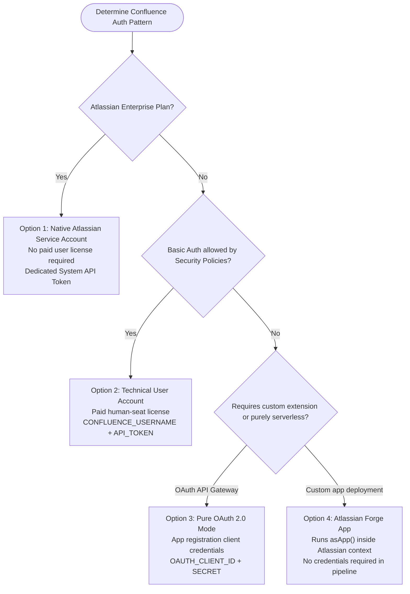

# Confluence Ingestion Requisites & Authentication Architecture

This document details the authentication and authorization pathways available for the Confluence Ingestion Pipeline (`ingest_gcs.py`). It covers standard Basic Auth, native Service Accounts, Pure OAuth 2.0 configuration, Forge Apps, and troubleshooting steps for permissions.

---

## 📖 Newbie Summary

The Confluence ingestion pipeline crawls pages, spaces, and attachments from your Atlassian Confluence site and processes them into structured Markdown for indexing. To query the Atlassian APIs, the pipeline needs credentials. Depending on your organization's security posture and licensing, you can configure the crawler in one of two modes:

1.  **Hybrid Mode (Basic Auth + OAuth 2.0)**: Uses a username (email) and personal/technical API token to download page content and spaces, and optionally uses OAuth 2.0 Client Credentials to download media attachments.
2.  **Pure OAuth 2.0 Mode (App-Only Auth)**: Uses client credentials (`Client ID` and `Client Secret`) from a registered Atlassian developer app. It accesses all REST APIs and attachments via Atlassian's secure OAuth gateway, removing the need for a dedicated user account or password.

---

## 🚦 Ingestion Authentication Matrix

Below is a comparison of the authentication approaches available for scheduled enterprise pipelines:

| Integration Pattern | Authentication Method | User License Needed | GCP Environment Setup |
| :--- | :--- | :--- | :--- |
| **Technical User Account** | Basic Auth: `CONFLUENCE_USERNAME` + `CONFLUENCE_API_TOKEN` | **Yes** (Paid standard human seat) | Simple env var injection |
| **Atlassian Service Account** | Dedicated System API Token | **No** (Enterprise Subscription Only) | Simple env var injection |
| **Pure OAuth 2.0 (App-Only)** | `CONFLUENCE_OAUTH_CLIENT_ID` + `CONFLUENCE_OAUTH_CLIENT_SECRET` | **No** (Uses developer app client credentials) | Advanced routing to OAuth gateway |
| **Atlassian Forge App** | App System Identity (Executed as `asApp()`) | **No** (Runs inside Forge framework) | Deployed natively in Atlassian |

---

## 🧠 Decision Flow Chart

Use the following flowchart to select the correct authentication pattern for your deployment:



---

## 1. Technical User Account (Option 2 - Standard Plans)

If your enterprise uses Atlassian Standard or Premium subscriptions, you do not have native system service accounts. 

*   **How it works**: Your IT team creates a dedicated, non-human email address on your identity provider (e.g., Okta, Entra ID, or Google Workspace) such as `confluence-rag-bot@yourcompany.com`.
*   **Permissions**: You assign the user a standard Confluence license and grant read-only permissions to target spaces.
*   **Credentials**: Log in once as the bot and generate an API token from Atlassian's account settings page.
*   **Pipeline Config**:
    ```ini
    CONFLUENCE_USERNAME=confluence-rag-bot@yourcompany.com
    CONFLUENCE_API_TOKEN=ATATT3xFfGF0... # The generated token
    ```

---

## 2. Native Atlassian Service Accounts (Option 1 - Enterprise Plans Only)

For organizations subscribed to the **Atlassian Enterprise Plan**, Atlassian offers native Service Accounts.

*   **How it works**: You create the service account directly in the Atlassian Admin Console (`admin.atlassian.com`).
*   **Benefits**: These accounts do not require an external identity provider email address and do not consume a paid user license seat. You generate a dedicated System API Token to use as `CONFLUENCE_API_TOKEN` under Basic Auth.

---

## 3. Pure OAuth 2.0 Ingestion (Option 3 - App-Only Auth)

The ingestion script [ingest_gcs.py](file:///e:/GCP/HCL_Demos/demo_agents/rag_agent_rag_engine/rag_agent/ingest_gcs.py) supports **Pure OAuth 2.0 Authentication** using only a Client ID and Client Secret. This avoids Basic Auth and does not consume a paid human seat.

### How Pure OAuth 2.0 Works under the Hood

When you omit `CONFLUENCE_USERNAME` and `CONFLUENCE_API_TOKEN` but provide `CONFLUENCE_OAUTH_CLIENT_ID` and `CONFLUENCE_OAUTH_CLIENT_SECRET`:

```
+------------------+     OAuth 2.0 Token Exchange      +-------------------+
|  Ingest Pipeline | --------------------------------> | Atlassian Auth SRV|
|  (Local/GCP Job) | <-------------------------------- | (Issues Bearer TK)|
+------------------+                                   +-------------------+
         |
         | Fetch pages & spaces
         v
+--------------------------------------------------------------------------+
| Atlassian OAuth Gateway: api.atlassian.com/ex/confluence/{cloud_id}/     |
| (Requests sent with Bearer Token in 'Authorization: Bearer' headers)     |
+--------------------------------------------------------------------------+
```

1.  **Auto-Detection**: The script checks if Basic Auth variables are absent. If `CONFLUENCE_OAUTH_CLIENT_ID` and `CONFLUENCE_OAUTH_CLIENT_SECRET` are set, it toggles into **OAuth 2.0 Mode**.
2.  **Token Exchange & Cloud ID Resolution**:
    *   Exchanges client credentials for an access token via Atlassian auth servers.
    *   Resolves your site's UUID `ATLASSIAN_CLOUD_ID` using the token (or falls back to the configured env variable).
3.  **API Gateway Redirection**:
    Instead of sending queries to `https://your-domain.atlassian.net/wiki/rest/api/...` (which requires Basic Auth), the script dynamically redirects all queries to Atlassian's OAuth gateway:
    `https://api.atlassian.com/ex/confluence/{cloud_id}/rest/api/...`
4.  **Header Propagation**:
    *   It appends `Authorization: Bearer <token>` to all requests.
    *   `download_attachment` and `process_single_page` are refactored to accept and propagate the dynamic OAuth headers, ensuring child attachments and inline images are downloaded securely over OAuth 2.0.

### Configuration Template
```ini
# Base site details
CONFLUENCE_URL=https://your-enterprise.atlassian.net

# Pure OAuth 2.0 Credentials (No Username/API Token required)
CONFLUENCE_OAUTH_CLIENT_ID=your_oauth_client_id
CONFLUENCE_OAUTH_CLIENT_SECRET=your_oauth_client_secret

# The Confluence spaces to index
CONFLUENCE_SPACES=SPACE1,SPACE2

# Optional: Set this to bypass accessible-resources endpoint lookups
ATLASSIAN_CLOUD_ID=your_cloud_id
```

---

## 4. Atlassian Forge App (Option 4 - Developer Option)

If your enterprise blocks external API connections, you can deploy a custom **Atlassian Forge App**:

*   **How it works**: You write a small app using Atlassian's Forge framework and deploy it directly on Atlassian's infrastructure.
*   **Authentication**: The app runs queries using the native `asApp()` method. This runs in the system context of the app itself, removing the need to manage secrets or credentials inside your external CI/CD pipelines.

---

## 🔍 Troubleshooting 403 Forbidden & Permissions Errors

When running in **OAuth 2.0 Mode**, a `403 Forbidden` response indicates that the Client credentials are valid (otherwise, it would return `401 Unauthorized`), but the app doesn't have permission to retrieve the requested resource.

### Cause 1: Missing API Scopes in Atlassian Developer Console
*   **Problem**: The developer app was not granted the necessary read permissions.
*   **Solution**:
    1. Go to [Atlassian Developer Console](https://developer.atlassian.com) and select your App.
    2. Go to **Permissions** (or Scopes) in the sidebar.
    3. Find **Confluence Cloud API** and click Configure.
    4. Enable the following scopes:
        *   `read:confluence-space.summary` (List spaces)
        *   `read:confluence-content.summary` (List pages)
        *   `read:confluence-content.all` (Read page body text)
        *   `read:confluence-content.attachments` (Download attachments)
    5. Save changes. Re-acquire a new token or wait 15 minutes for propagation.

### Cause 2: App is Not Installed or Authorized on the Confluence Site
*   **Problem**: An administrator has not authorized the app to read data on your specific tenant.
*   **Solution**:
    1. An administrator must go to `https://admin.atlassian.com`.
    2. Navigate to **Settings** -> **Connected Apps** (or OAuth 2.0 Integrations).
    3. Ensure the App is authorized for the target Cloud ID.

### Cause 3: The App's Virtual Service Actor Lacks Space Permissions
*   **Problem**: Confluence creates a "virtual user" representing the app. If this virtual user is blocked from reading the target space, the API returns `403`.
*   **Solution**:
    1. Go to the specific Confluence space.
    2. Click **Space Settings** -> **Permissions** (Space Admin permissions required).
    3. Under **Apps**, search for your App name and grant it Read/View access.

---

## ❓ Frequently Asked Questions

### Why can't I see the "Permissions" option under Space Settings?
*   You must be a **Space Admin** to view or edit space-level permissions. If the button is missing, contact the space creator or an Atlassian Administrator to grant you Space Admin rights.

### Why does a "Publicly Accessible" space still return 403 Forbidden?
*   Confluence evaluates the token's authenticated client identity even on public spaces. If the app's virtual service actor is not granted explicit reading permission, Confluence returns a `403 Forbidden` rather than falling back to anonymous access.

### Why do standard Confluence REST APIs reject Client Credentials (2LO) tokens?
*   Atlassian's standard OAuth 2.0 API gateway restricts direct client credentials access for certain endpoints. To bypass this, the crawler routes requests to the **OAuth Gateway Resource URL** (`https://api.atlassian.com/ex/confluence/...`) and requests the appropriate scopes.

---

## 🔒 Securing Credentials in Production CI/CD

To secure your production credentials, avoid checking them into git or hardcoding them in scripts. Use these patterns:

*   **GitHub Actions**: Save secrets under **Repository Secrets** and reference them in your workflow YAML:
    ```yaml
    env:
      CONFLUENCE_USERNAME: ${{ secrets.CONFLUENCE_USERNAME }}
      CONFLUENCE_API_TOKEN: ${{ secrets.CONFLUENCE_API_TOKEN }}
    ```
*   **GitLab CI**: Save secrets as **Masked & Protected CI/CD Variables** in your repository settings.
*   **Google Cloud Secret Manager**: If deployed on GCP (Cloud Run Jobs), load credentials dynamically at startup using Google Cloud Secret Manager. Inject them as environment variables during job creation or container execution.