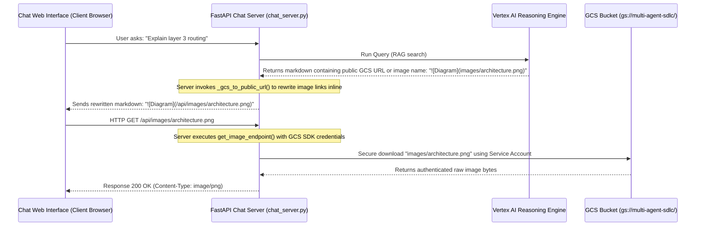

# RAG Ingestion & Image Proxy Enhancements

This document captures the enhancements added to the Confluence Knowledge Ingestion and the secure image display architecture.

---

## 1. Automated HTML Table-to-Markdown Converter

Confluence page contents are written in XHTML storage format, containing raw `<table>` structures. Previously, the ingestion pipeline flat-stripped HTML tags, resulting in structural data loss in the indexed text blocks.

### Enhancement
Implemented `_convert_html_tables_to_markdown` inside `rag_agent/ingest_gcs.py`:
* **BeautifulSoup Parsing:** Uses `bs4` to target and parse XHTML table components (`<table>`, `<tr>`, `<td>`, `<th>`).
* **Column Preservation:** Dynamically calculates maximum column widths to construct a clean Markdown grid.
* **Cell Formatting:** Collapses internal block tags (like `
` or `
`) using space delimiters to avoid introducing syntax-breaking newlines in markdown rows, and escapes any pipe characters (`|` to `\|`) inside cell contents.
* **Separators:** Generates proper markdown alignment headers (`|---|---|`).

---

## 2. Document Attachment Processing & Cloud Archiving

Confluence pages can include non-image files such as PDFs, Word documents, PowerPoint presentations, Excel spreadsheets, and CSVs.

### Ingestion Workflow
We integrated an automated child-attachment fetching routine into the Confluence crawling loop:
1. **API Child Lookup:** For every crawled page, queries `.../child/attachment` to retrieve associated documents.
2. **Download & Transient Storage:** Downloads standard attachment files into a local transient directory `/raw_attachments`.
3. **Parsing & Formatting:**
   * **Gemini Primary Parser:** Sends PDF, DOCX, and PPTX bytes directly to Gemini 2.5 (`gemini-2.5-flash`) via `types.Part.from_bytes` to convert the documents into structured Markdown, reconstructing tables and textual layout natively.
   * **Lightweight Fallbacks:**
     * **Word (`.docx`) & PowerPoint (`.pptx`):** Uses pure-Python XML parsing via built-in `zipfile` and `xml.etree.ElementTree` to read slides (`ppt/slides/slide*.xml`) and documents (`word/document.xml`) directly without requiring external heavy packages.
     * **PDF (`.pdf`):** Extracts textual layers using `pypdf`.
     * **Spreadsheets (`.xlsx`, `.csv`):** Converts data sheets using `pandas` and `openpyxl` directly into Markdown tables via `df.to_markdown()`.
4. **Embedded Image Extraction:** Uses `pypdf` (for PDF) and `zipfile` (for DOCX/PPTX media folders) to extract embedded images, captions them via Gemini, and links them inline as standard markdown images.
5. **Context Metadata Injection:** Appends parent metadata (`source_url` pointing to the main Confluence page, parent page title, space key, document ID) so Vertex AI Search chunks can resolve search citations back to the parent source.
6. **Cloud Archiving:**
   * **Markdown Documents:** Uploaded as searchable `.md` files to the bucket root (e.g., `gs://multi-agent-sdlc/[Attachment]_Parent_Page_-_Filename.md`).
   * **Original Binary Files:** Saved under `gs://multi-agent-sdlc/raw_attachments/{filename}`.
   * **Transient Clean-up:** Automatically deletes local temporary directories after GCS synchronization to keep client disk usage pristine.

---

## 3. Secure GCS Image Proxy Architecture

### The Problem
Google Cloud Storage buckets used for corporate assets enforce **Public Access Prevention (PAP)** to protect PII and prevent data exposure. Because of this, GCS files cannot be directly read via standard public anonymous URLs in front-end client browsers (resulting in HTTP `403 Forbidden` or CORS block errors).

### The Solution
The chat interface leverages a **Secure backend GCS Image Proxy** built directly into the FastAPI chat server (`rag_agent/chat_server.py`).

### Data Flow Diagram

### Architectural Benefits
1. **Zero Public Access:** The GCS bucket stays completely private.
2. **Identity Propagation:** Image bytes are downloaded using the server's backend service account (`app-svc-custom-sandbox@gebu-demo-sandbox.iam.gserviceaccount.com`), keeping credentials hidden from client-side inspectors.
3. **Automatic Link Rewriting:** `_gcs_to_public_url()` handles rewriting for multiple patterns:
   * Relative paths: `images/img.png` $\rightarrow$ `/api/images/img.png`
   * Direct GCS public paths: `https://storage.googleapis.com/multi-agent-sdlc/images/img.png` $\rightarrow$ `/api/images/img.png`
   * Confluence attachments: `https://.../download/attachments/.../img.png` $\rightarrow$ `/api/images/img.png`
4. **Mime-type Resolution:** Dynamically maps file extensions (`.png`, `.jpg`, `.jpeg`, `.gif`, `.svg`) to proper HTTP media types for browser rendering.

---

## 4. Session Lifecycle & Image Parsing Optimizations

Two major stability and visual rendering upgrades were added to resolve live production issues in the chat server:

### A. Session Lifecycle Caching & Handshaking
* **The Problem:** On every streaming or direct query request, the frontend sends a persistent `sessionId` to maintain chat memory. However, the client-side Vertex AI Agent Engine `async_create_session` call raises a `400 FAILED_PRECONDITION / 400 INVALID_ARGUMENT` exception if the session ID already exists in the backend session store. This caused redundant slow API roundtrips and printed scary exception stack traces.
* **The Solution:** We introduced an in-memory set cache (`_created_sessions`) in the FastAPI backend.
* **Mechanism:**
  1. The server checks if the requested `session_id` has already been created/verified during the server's lifecycle.
  2. If the ID is cached, the server bypasses the redundant `async_create_session`/`create_session` API call completely.
  3. If not cached, the server attempts session creation. If the backend returns a `"Session with user-provided ID ... already exists."` response, it is caught, added to the cache, and execution proceeds cleanly using the existing session without raising any failures.
  4. This eliminates backend error spikes and provides instant query streaming for multi-turn chats.

### B. Generalized Raw Image Filename Parser
* **The Problem:** When explaining architectural diagrams (such as the "Alpha architecture"), the model returns raw attachment or image filenames (like `architecture-bank-alpha.png`) in the text. The old pattern only supported literal `image.png` or `image-YYYYMMDD-HHMMSS.png` mentions, leaving other custom diagram names as plain text.
* **The Solution:** We upgraded the regex matching in the Python backend (`_gcs_to_public_url`) and JavaScript frontend (`formatAnswer`) to capture arbitrary valid image filenames.
* **Regex Design:**
  * **Pattern:** `(?<![a-zA-Z0-9_/-])(?<!\]\()([a-zA-Z0-9_-]+\.(?:png|jpg|jpeg|gif|svg|webp))\b`
  * **Features:**
    1. Matches any alphanumeric, hyphenated, or underscored filename with standard extensions (`.png`, `.jpg`, `.jpeg`, `.gif`, `.svg`, `.webp`).
    2. Utilizes dual negative lookbehinds to prevent rewriting paths starting with `/` or `/[path]` (like `/api/images/...`) and files already formatted as standard Markdown images/links preceded by `](` (like `[Alt Text](filename.png)`).
    3. Gracefully supports raw names inside standard text flow and plain parenthesized contexts (e.g. `(architecture-bank-alpha.png)` is converted to parenthesized inline images), fully rendering diagrams in the chat UI.

