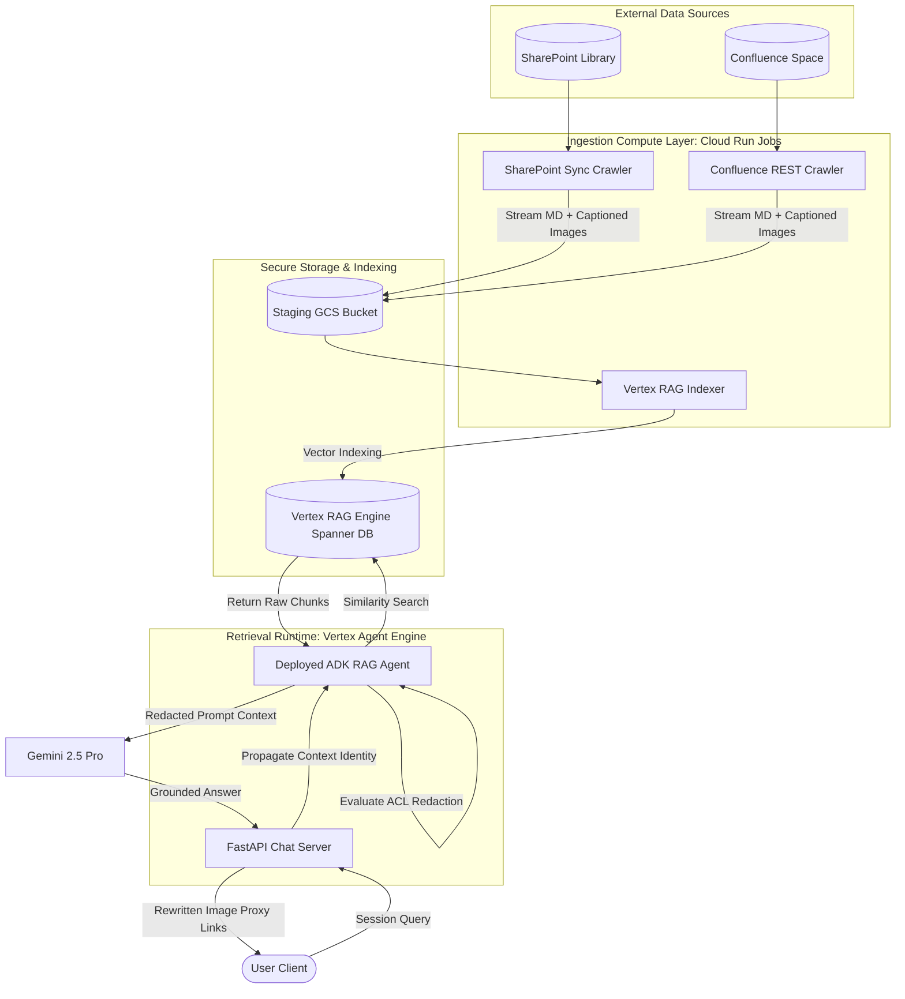

# Corporate Knowledge Retriever (RAG Agent)

An enterprise-grade, serverless Retrieval-Augmented Generation (RAG) system built on Google Cloud Platform (GCP). It crawls, indexes, and retrieves official corporate documentation from **Confluence** spaces and **SharePoint** document libraries, utilizing Google Cloud **Vertex AI RAG Engine** (backed by Managed Cloud Spanner) and **Gemini 2.5 Pro / Flash** for intelligent, context-grounded Q&A.

---

## 🚀 System Architecture Overview

The system operates in two core phases: **Episodic Ingestion** (crawling data sources, parsing files, captioning images, and indexing vectors) and **Session Retrieval** (querying the deployed agent runtime with context-based Access Control List (ACL) security).



---

## 📂 Interactive Documentation Hub

This repository contains detailed subsystem specifications. Click the links below to navigate directly to the respective documentation:

### 🏗️ Architecture & Core System Design
*   [System Architecture Report](architecture_report.md) — Details the serverless compute layers, polymorphic container designs, memory-safe stream-and-upload loops, and multi-environment migrations.
*   [Ingestion Data Flow & Chunking Strategy](ingestion_flow.md) — Explains chronological crawl loops, spreadsheet memory preservation, layout-aware native markdown chunk boundaries, and metadata headers.
*   [Multiple Sites scaling Analysis](ingest_multiple_sites.md) — Explores HNSW vector indexing quality, database transactional scale (Cloud Spanner vs Vector Search), and multi-site white-listing.

### 🔒 Enterprise Security & Authorization
*   [Access Control List (ACL) Implementation](acl_implementation.md) — Breaks down thread-safe user state propagation using Python `contextvars` and post-retrieval chunk-level redaction filters.
*   [Confluence Ingestion Requisites](CONFLUENCE_REQUISITES.md) — Outlines Basic Auth vs. OAuth 2.0 credential options, site access matrices, and detailed `403 Forbidden` troubleshooting steps.

### 🤖 Prompt Engineering & Enhancements
*   [RAG Agent Instructions Prompt](INSTRUCTION.md) — The system prompt defining retrieval citation rules, table representation, and inline visual rendering.
*   [Ingestion Enhancements Log](ENHANCEMENTS.md) — Captures BS4 table-to-markdown converters, attachment parsing logic, and the secure GCS Image Proxy gateway.

### ⚙️ Automation & Deployment
*   [Enterprise CI/CD Pipelines Guide](cicd/PIPELINE_SETUP.md) — Step-by-step templates for GitHub Actions, GitLab CI/CD, Google Cloud Scheduler, and Secret Manager integrations.

---

## 🛠️ Implementation & Deployment Models

The retriever agent is built on Google's **Agent Development Kit (ADK)** and deployed to **Vertex AI Agent Engine (Reasoning Engine)**. The repository supports two distinct packaging and deployment paths:

### 1. AdkApp Pathway (`deploy_adk.py`)
*   **Purpose**: Simplifies testing and debugging by exposing a standard, single-method interface.
*   **Deployment Script**: [deploy_adk.py](deploy_adk.py)
*   **Features**: Automatically wraps the root agent defined in [agent_rag.py](agent_rag.py) inside Google's `AdkApp` framework. This enables direct, synchronous testing in the **GCP Console Reasoning Engine Playground** without needing complex API headers or task states.
*   **Requirements**: Uses [requirements_adk.txt](requirements_adk.txt) (excluding A2A SDK to prevent schema conflicts during compilation).

### 2. A2aAgent Pathway (`deploy.py`)
*   **Purpose**: Production standard for enterprise systems requiring asynchronous Agent-to-Agent task coordination.
*   **Deployment Script**: [deploy.py](deploy.py)
*   **Features**: Deploys the agent as an `A2aAgent` instance bound to an asynchronous `AgentExecutor` ([executor.py](executor.py)). The runtime intercepts standard A2A `Task` structures, logs execution states to Cloud Firestore ([firestore_task_store.py](firestore_task_store.py)), and extracts request metadata.
*   **Requirements**: Uses [requirements.txt](requirements.txt).

---

## 📂 Repository Directory Structure

```text
├── .env.example               # Template environment configuration file
├── acl_implementation.md      # Access Control List & contextvars design
├── agent.py                   # ADK Agent using Discovery Engine retriever
├── agent_card.py              # Deployment metadata card specification
├── agent_engine_entry.py      # Reasoning Engine A2aAgent entrypoint router
├── agent_rag.py               # Core ADK Agent using Vertex RAG Corpus
├── architecture_report.md     # Serverless system architecture specification
├── chat_server.py             # FastAPI chat server & secure image proxy
├── check_confluence_space.py  # Utility to verify Confluence space permissions
├── confluence_rag.py          # Local helper to run Confluence RAG queries
├── deploy.py                  # A2A deployment script for Agent Engine
├── deploy_adk.py              # AdkApp deployment script for Agent Engine
├── deploy_cloud_run_job.sh    # Script to submit builds and deploy ingestion jobs
├── executor.py                # AgentExecutor handling A2A task loops
├── firestore_task_store.py    # Firestore task store implementation for A2A
├── ingest_gcs.py              # Confluence crawl & extraction pipeline script
├── ingest_sharepoint_gcs.py   # SharePoint crawl & extraction pipeline script
├── main.py                    # Entrypoint toggling local uvicorn / A2aAgent
├── push_rag_engine.py         # Sync script importing GCS MD files to RAG Corpus
├── requirements.txt           # Python packages required for A2A deployments
├── requirements_adk.txt       # Python packages required for AdkApp deployments
├── run_job.sh                 # Cloud Run container CLI argument entrypoint
├── telemetry.py               # OpenTelemetry trace & span configurations
├── cicd/                      # CI/CD configurations
│   ├── PIPELINE_SETUP.md      # CI/CD deployment guide
│   ├── Dockerfile             # Multi-stage build container specification
│   ├── github_action_ingest.yml # GitHub Actions pipeline template
│   └── gitlab_ci_ingest.yml   # GitLab CI/CD pipeline template
├── test_scripts/              # Testing and inspection utilities
│   ├── test_local_server.py   # Simulates local API requests
│   ├── test_image_proxy.py    # Validates GCS proxy image downloads
│   └── inspect_adk_app.py     # Inspects compiled AdkApp methods
└── verify_confluence_ingestion.py # Local verification script
```

---

## 🚀 Getting Started

### 1. Configure the Environment
Create your local environment file:
```bash
cp .env.example .env
```
Open `.env` and configure your GCP Project, target Confluence URLs/Spaces, and SharePoint Client/Tenant IDs.

### 2. Local Setup
Create a virtual environment and install dependencies:
```bash
python -m venv .venv
source .venv/bin/activate  # On Windows use: .venv\Scripts\activate
pip install -r requirements.txt
```

### 3. Run Ingestion (Local Simulation Mode)
Test the SharePoint and Confluence crawlers locally:
```bash
# Sets ingestion mode to simulate APIs without hitting rate limits
export SHAREPOINT_INGEST_MODE=local_sim
python -m rag_agent.run_job confluence
python -m rag_agent.run_job sharepoint
```

### 4. Start Chat Assistant Server
Run the local FastAPI server serving the web interface:
```bash
python -m uvicorn rag_agent.chat_server:app --host 0.0.0.0 --port 8080
```
Open `http://localhost:8080` in your web browser. You can select roles (Guest, Developer, HR Manager) in the dropdown to simulate the security ACL redaction in real-time.
