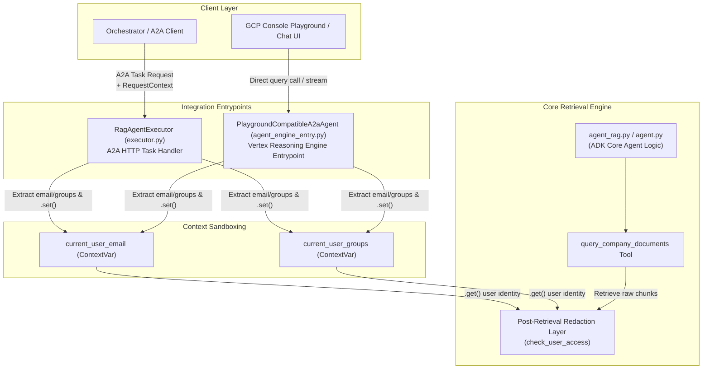
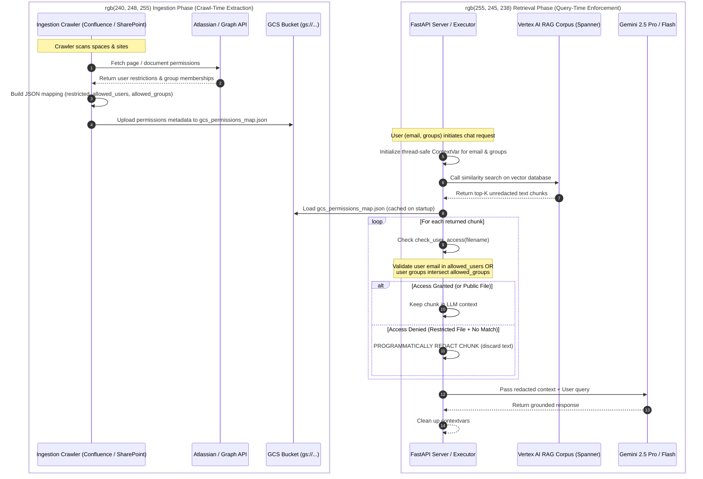

# Enterprise Access Control List (ACL) & Query-Time Redaction Architecture

This document provides a comprehensive breakdown of the security architecture governing the Corporate Knowledge Retriever (RAG Agent). It explains how document access permissions are crawler-extracted, runtime-propagated, and programmatically enforced to ensure data safety across all deployment pathways.

---

## 📖 Newbie Terminology Guide

If you are new to the codebase or Google Cloud's AI suite, here are the core concepts used throughout this document:

*   **ADK (Agent Development Kit)**: Google's Python framework used to build and package agentic applications. It provides standard wrappers and class structures (like `LlmAgent` and `AdkApp`) to declare tools, system instructions, and execution boundaries.
*   **Reasoning Engine (Vertex AI Agent Engine)**: Google Cloud's managed serverless runtime environment. It hosts ADK-based agents, handles execution resource scaling, and exposes standardized REST and gRPC endpoints for client applications.
*   **A2A (Agent-to-Agent)**: An enterprise messaging and execution protocol used to chain autonomous agents together. When our RAG agent runs in an A2A ecosystem, it receives structured `Task` payloads and client metadata rather than simple text streams.
*   **ContextVars (`contextvars`)**: A built-in Python library that provides thread-safe, asynchronous task-local variable storage. It functions like Thread-Local Storage (TLS) but is optimized for modern Python `async/await` tasks, preventing concurrent request metadata from leaking between different users.

---

## 1. Deployment and Integration Status (A2A and ADK)

The security and identity checking system is fully active across both integration paths supported by this agent:

1.  **A2A Integration**: The updated [executor.py](file:///e:/GCP/HCL_Demos/demo_agents/rag_agent_rag_engine/rag_agent/executor.py) (`RagAgentExecutor`) implements the Agent-to-Agent protocol. It intercepts the incoming A2A `Task` and `RequestContext` metadata, extracts the user's authenticated email and group list, initializes the thread-safe `contextvars`, and runs the ADK agent executor.
2.  **ADK / Vertex Reasoning Engine Integration**: The core agent is built using the Google ADK, defined in [agent_rag.py](file:///e:/GCP/HCL_Demos/demo_agents/rag_agent_rag_engine/rag_agent/agent_rag.py). When deployed directly to Vertex AI Reasoning Engine, playground queries and client API streams route through [agent_engine_entry.py](file:///e:/GCP/HCL_Demos/demo_agents/rag_agent_rag_engine/rag_agent/agent_engine_entry.py), which performs identical identity propagation and sandbox cleanup.

Because both wrappers execute the same core agent logic inside [agent_rag.py](file:///e:/GCP/HCL_Demos/demo_agents/rag_agent_rag_engine/rag_agent/agent_rag.py), updating the core retrieval rules secures all execution flows simultaneously.

### Identity Propagation Flow

The following Mermaid diagram shows how both entrypoints securely capture user identities and forward them down to the retrieval logic:



---

## 2. What is `contextvars.ContextVar` and How Does It Help?

In a concurrent server (like FastAPI or the A2A executor) handling dozens of queries simultaneously, a simple global variable like `current_user = "bob@example.com"` is highly insecure. If Alice and Bob query at the same time, Alice’s request might overwrite the global variable, causing Bob to retrieve Alice’s private documents.

To prevent this, Python provides the `contextvars` module:
*   A `ContextVar` acts as a thread-safe, task-isolated container (similar to Thread-Local Storage but optimized for modern `async/await` asynchronous tasks).
*   When a request starts, the server calls `current_user_email.set("bob@example.com")`. This value is bound only to the execution context of Bob's specific async task/thread.
*   Even if Alice's concurrent request sets `current_user_email.set("alice@example.com")` a millisecond later, the two contexts are completely sandboxed. They can never leak, overwrite, or access each other's values.
*   Calling `current_user_email.get()` fetches the value associated only with the currently running task's context.

This is extremely powerful because it allows us to securely pass user identity deep down into ADK's nested tool methods without having to change the framework's internal tool function signatures.

---

## 3. How Runtime Identity and Crawled Permissions Map

The security pipeline consists of two distinct phases: **Crawl-Time Ingestion** and **Query-Time Enforcement**.



### Detailed Lifecycle Steps

#### Step A: Crawl-Time extraction (The Permissions Map)
During the ingestion crawl, Confluence and SharePoint crawlers query Atlassian/Graph APIs to find out who has access to a document. If `sensitive_payroll.docx` is restricted, they write this entry to `gcs_permissions_map.json` and synchronize it to GCS:
```json
"sensitive_payroll.docx": {
  "restricted": true,
  "allowed_users": ["hr_manager@company.com"],
  "allowed_groups": ["HR_TEAM", "EXEC_BOARD"]
}
```

#### Step B: Client queries the RAG Assistant (Runtime Setup)
When Bob queries the assistant, the server authenticates Bob and extracts his identity metadata:
*   Email: `bob@company.com`
*   Groups: `["DEVELOPERS", "HR_TEAM"]`

The server sets these values in the isolated context:
```python
email_token = current_user_email.set("bob@company.com")
groups_token = current_user_groups.set(["DEVELOPERS", "HR_TEAM"])
```

#### Step C: Retrieval and Redaction Check
The RAG Assistant queries Spanner and retrieves the top matching vector chunks. For each retrieved chunk:
1.  The assistant reads the chunk's source filename (e.g. `sensitive_payroll.docx`).
2.  It calls `check_user_access("sensitive_payroll.docx", email, groups)`.
3.  Inside this function, it retrieves Bob's sandbox context:
    ```python
    email = current_user_email.get()   # Returns "bob@company.com"
    groups = current_user_groups.get() # Returns ["DEVELOPERS", "HR_TEAM"]
    ```
4.  It looks up the permissions for `sensitive_payroll.docx` from `gcs_permissions_map.json` and evaluates the rules:
    *   **Email Match Check**: Is `"bob@company.com"` in `allowed_users` (`["hr_manager@company.com"]`)? No.
    *   **Group Overlap Match Check**: Does any group in `["DEVELOPERS", "HR_TEAM"]` exist in `allowed_groups` (`["HR_TEAM", "EXEC_BOARD"]`)? Yes! (The group `"HR_TEAM"` overlaps).
5.  Since the group match is successful, `check_user_access` returns `True` and the chunk is kept in the LLM's prompt context. If both checks had failed, the chunk would be programmatically discarded (redacted) before the prompt is formatted and sent to Gemini, guaranteeing total data safety.

---

## 4. Group Memberships & Enterprise RBAC

> So in enterprises user email may not be included in "allowed_users" metadata tag and directly user may be part of groups included in "allowed_groups" metadata tag. Our architecture takes care of that as well right?

**Yes, absolutely.** The security system is explicitly designed to handle this exact enterprise scenario.

In large organizations, document permissions are almost always managed at the group level (e.g., AD groups, Entra ID groups, or Atlassian groups) rather than listing thousands of individual user emails.

Here is exactly how our checking engine (`check_user_access`) handles this:

1.  **Independent Email Verification**: The engine first checks if the user's individual email is listed in `allowed_users`. If it is, access is instantly granted. If it is not, it gracefully continues.
2.  **Granular Group Intersection**: The engine then extracts all the security groups the querying user belongs to (`current_user_groups.get()`) and performs an intersection check against the document's `allowed_groups`:
    ```python
    # Check groups (case-insensitive)
    allowed_groups = [g.lower() for g in perm.get("allowed_groups", [])]
    user_groups_lower = [g.lower() for g in groups]
    for g in user_groups_lower:
        if g in allowed_groups:
            return True
    ```
3.  **Result**: If the user belongs to even a single group that has access to the document (such as `HR_TEAM` or `ENGINEERING_LEADS`), access is granted (`True`) and the chunk is retained.

This structure guarantees that your RAG assistant remains secure, scalable, and completely aligned with modern enterprise identity provider standard Role-Based Access Control (RBAC) practices.

> [!IMPORTANT]
> **No Accidental Content Blocking**:
> - If a document has no read restrictions on Confluence or SharePoint, it is treated as **Public** and is never redacted.
> - "Restricted" files are only hidden from users who do not have permission on the source systems.
> - Dynamic query-time redaction acts as a programmatically enforced mirror of your source repositories.
