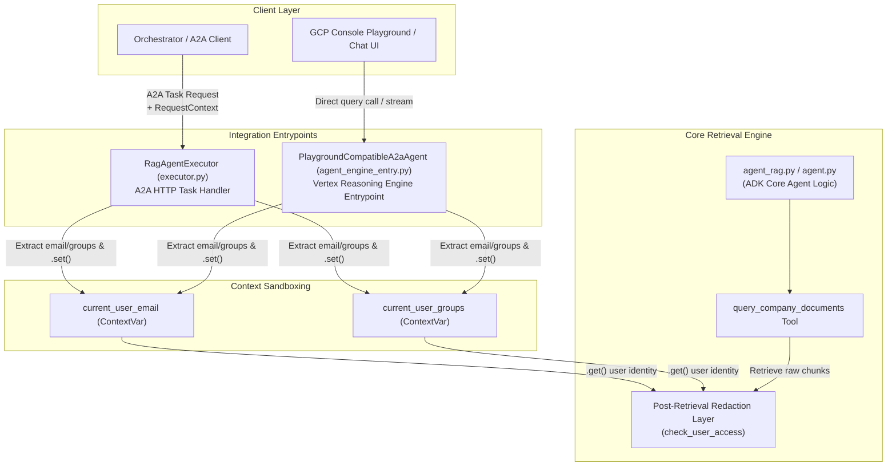
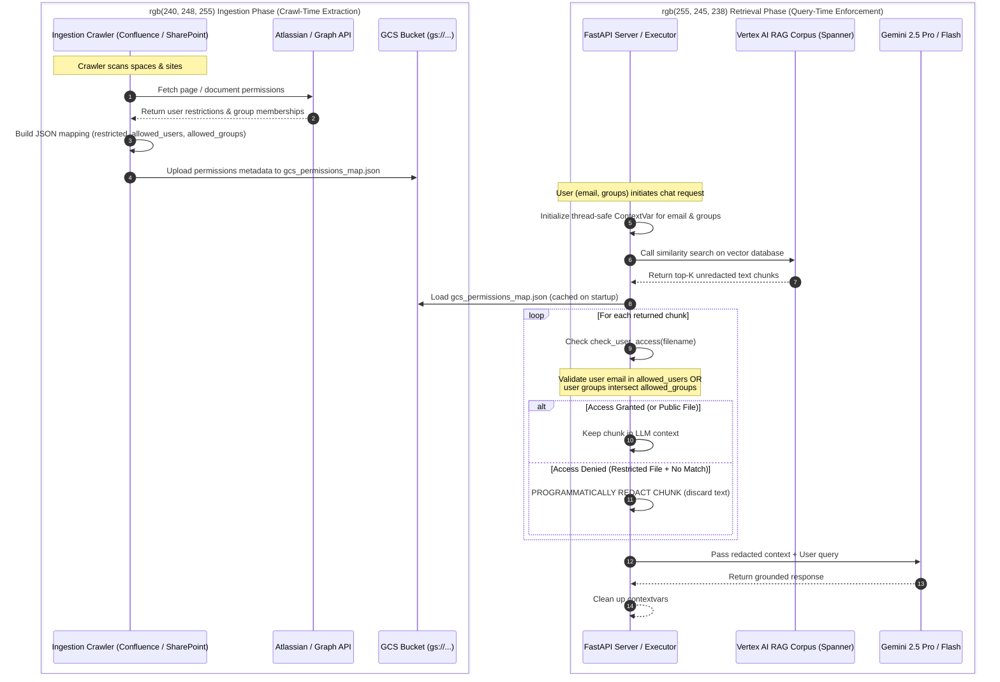

# Enterprise Access Control List (ACL) & Query-Time Redaction Architecture

This document provides a comprehensive breakdown of the security architecture governing the Corporate Knowledge Retriever (RAG Agent). It explains how document access permissions are crawler-extracted, runtime-propagated, and programmatically enforced to ensure data safety across all deployment pathways.

---

## 📖 Newbie Terminology Guide

If you are new to the codebase or Google Cloud's AI suite, here are the core concepts used throughout this document:

*   **ADK (Agent Development Kit)**: Google's Python framework used to build and package agentic applications. It provides standard wrappers and class structures (like `LlmAgent` and `AdkApp`) to declare tools, system instructions, and execution boundaries.
*   **Reasoning Engine (Vertex AI Agent Engine)**: Google Cloud's managed serverless runtime environment. It hosts ADK-based agents, handles execution resource scaling, and exposes standardized REST and gRPC endpoints for client applications.
*   **A2A (Agent-to-Agent)**: An enterprise messaging and execution protocol used to chain autonomous agents together. When our RAG agent runs in an A2A ecosystem, it receives structured `Task` payloads and client metadata rather than simple text streams.
*   **ContextVars (`contextvars`)**: A built-in Python library that provides thread-safe, asynchronous task-local variable storage. It functions like Thread-Local Storage (TLS) but is optimized for modern Python `async/await` tasks, preventing concurrent request metadata from leaking between different users.

---

## 1. Deployment and Integration Status (A2A and ADK)

The security and identity checking system is fully active across both integration paths supported by this agent:

1.  **A2A Integration**: The updated [executor.py](file:///e:/GCP/HCL_Demos/demo_agents/rag_agent_rag_engine/rag_agent/executor.py) (`RagAgentExecutor`) implements the Agent-to-Agent protocol. It intercepts the incoming A2A `Task` and `RequestContext` metadata, extracts the user's authenticated email and group list, initializes the thread-safe `contextvars`, and runs the ADK agent executor.
2.  **ADK / Vertex Reasoning Engine Integration**: The core agent is built using the Google ADK, defined in [agent_rag.py](file:///e:/GCP/HCL_Demos/demo_agents/rag_agent_rag_engine/rag_agent/agent_rag.py). When deployed directly to Vertex AI Reasoning Engine, playground queries and client API streams route through [agent_engine_entry.py](file:///e:/GCP/HCL_Demos/demo_agents/rag_agent_rag_engine/rag_agent/agent_engine_entry.py), which performs identical identity propagation and sandbox cleanup.

Because both wrappers execute the same core agent logic inside [agent_rag.py](file:///e:/GCP/HCL_Demos/demo_agents/rag_agent_rag_engine/rag_agent/agent_rag.py), updating the core retrieval rules secures all execution flows simultaneously.

### Identity Propagation Flow

The following Mermaid diagram shows how both entrypoints securely capture user identities and forward them down to the retrieval logic:



---

## 2. What is `contextvars.ContextVar` and How Does It Help?

In a concurrent server (like FastAPI or the A2A executor) handling dozens of queries simultaneously, a simple global variable like `current_user = "bob@example.com"` is highly insecure. If Alice and Bob query at the same time, Alice’s request might overwrite the global variable, causing Bob to retrieve Alice’s private documents.

To prevent this, Python provides the `contextvars` module:
*   A `ContextVar` acts as a thread-safe, task-isolated container (similar to Thread-Local Storage but optimized for modern `async/await` asynchronous tasks).
*   When a request starts, the server calls `current_user_email.set("bob@example.com")`. This value is bound only to the execution context of Bob's specific async task/thread.
*   Even if Alice's concurrent request sets `current_user_email.set("alice@example.com")` a millisecond later, the two contexts are completely sandboxed. They can never leak, overwrite, or access each other's values.
*   Calling `current_user_email.get()` fetches the value associated only with the currently running task's context.

This is extremely powerful because it allows us to securely pass user identity deep down into ADK's nested tool methods without having to change the framework's internal tool function signatures.

---

## 3. How Runtime Identity and Crawled Permissions Map

The security pipeline consists of two distinct phases: **Crawl-Time Ingestion** and **Query-Time Enforcement**.



### Detailed Lifecycle Steps

#### Step A: Crawl-Time extraction (The Permissions Map)
During the ingestion crawl, Confluence and SharePoint crawlers query Atlassian/Graph APIs to find out who has access to a document. If `sensitive_payroll.docx` is restricted, they write this entry to `gcs_permissions_map.json` and synchronize it to GCS:
```json
"sensitive_payroll.docx": {
  "restricted": true,
  "allowed_users": ["hr_manager@company.com"],
  "allowed_groups": ["HR_TEAM", "EXEC_BOARD"]
}
```

#### Step B: Client queries the RAG Assistant (Runtime Setup)
When Bob queries the assistant, the server authenticates Bob and extracts his identity metadata:
*   Email: `bob@company.com`
*   Groups: `["DEVELOPERS", "HR_TEAM"]`

The server sets these values in the isolated context:
```python
email_token = current_user_email.set("bob@company.com")
groups_token = current_user_groups.set(["DEVELOPERS", "HR_TEAM"])
```

#### Step C: Retrieval and Redaction Check
The RAG Assistant queries Spanner and retrieves the top matching vector chunks. For each retrieved chunk:
1.  The assistant reads the chunk's source filename (e.g. `sensitive_payroll.docx`).
2.  It calls `check_user_access("sensitive_payroll.docx", email, groups)`.
3.  Inside this function, it retrieves Bob's sandbox context:
    ```python
    email = current_user_email.get()   # Returns "bob@company.com"
    groups = current_user_groups.get() # Returns ["DEVELOPERS", "HR_TEAM"]
    ```
4.  It looks up the permissions for `sensitive_payroll.docx` from `gcs_permissions_map.json` and evaluates the rules:
    *   **Email Match Check**: Is `"bob@company.com"` in `allowed_users` (`["hr_manager@company.com"]`)? No.
    *   **Group Overlap Match Check**: Does any group in `["DEVELOPERS", "HR_TEAM"]` exist in `allowed_groups` (`["HR_TEAM", "EXEC_BOARD"]`)? Yes! (The group `"HR_TEAM"` overlaps).
5.  Since the group match is successful, `check_user_access` returns `True` and the chunk is kept in the LLM's prompt context. If both checks had failed, the chunk would be programmatically discarded (redacted) before the prompt is formatted and sent to Gemini, guaranteeing total data safety.

---

## 4. Group Memberships & Enterprise RBAC

> So in enterprises user email may not be included in "allowed_users" metadata tag and directly user may be part of groups included in "allowed_groups" metadata tag. Our architecture takes care of that as well right?

**Yes, absolutely.** The security system is explicitly designed to handle this exact enterprise scenario.

In large organizations, document permissions are almost always managed at the group level (e.g., AD groups, Entra ID groups, or Atlassian groups) rather than listing thousands of individual user emails.

Here is exactly how our checking engine (`check_user_access`) handles this:

1.  **Independent Email Verification**: The engine first checks if the user's individual email is listed in `allowed_users`. If it is, access is instantly granted. If it is not, it gracefully continues.
2.  **Granular Group Intersection**: The engine then extracts all the security groups the querying user belongs to (`current_user_groups.get()`) and performs an intersection check against the document's `allowed_groups`:
    ```python
    # Check groups (case-insensitive)
    allowed_groups = [g.lower() for g in perm.get("allowed_groups", [])]
    user_groups_lower = [g.lower() for g in groups]
    for g in user_groups_lower:
        if g in allowed_groups:
            return True
    ```
3.  **Result**: If the user belongs to even a single group that has access to the document (such as `HR_TEAM` or `ENGINEERING_LEADS`), access is granted (`True`) and the chunk is retained.

This structure guarantees that your RAG assistant remains secure, scalable, and completely aligned with modern enterprise identity provider standard Role-Based Access Control (RBAC) practices.

> [!IMPORTANT]
> **No Accidental Content Blocking**:
> - If a document has no read restrictions on Confluence or SharePoint, it is treated as **Public** and is never redacted.
> - "Restricted" files are only hidden from users who do not have permission on the source systems.
> - Dynamic query-time redaction acts as a programmatically enforced mirror of your source repositories.

---

## 5. Ingestion Engine: Hybrid "Smart-Routing" Parser

To minimize expensive LLM API usage, eliminate rate-limiting bottlenecks, and drastically reduce crawling latency, the ingestion pipeline implements a **Hybrid "Smart-Routing" Parser**. This design uses extremely fast local libraries for standard text extraction while reserving Gemini multimodal reasoning solely for files that absolutely require it.

### Routing Rules and Workflow

```mermaid
graph TD
    File[Incoming File / Attachment] --> Type{Source / Format?}
    
    Type -->|Confluence Space Page| LocalHTML[Local XHTML to MD Parser<br>0 LLM calls, <5ms per page]
    Type -->|Standard PDF / DOCX / PPTX| Selectable{Contains Selectable Text?}
    
    Selectable -->|Yes| LocalExtract[Local Text Extraction<br>PyPDF / python-docx / python-pptx]
    Selectable -->|No (Scanned File)| GeminiOCR[Route to Gemini for Multimodal OCR]
    
    LocalExtract --> ImageCheck{Has Embedded Images?}
    ImageCheck -->|Yes| ExtractImg[Local Image Extraction]
    ExtractImg --> GeminiCap[Route ONLY Images to Gemini for Captioning]
    ImageCheck -->|No| FinalMD[Compile Final Enriched Markdown]
    
    LocalHTML --> FinalMD
    GeminiOCR --> FinalMD
    GeminiCap --> FinalMD
```

### Key Performance Benefits

*   **Cost Efficiency (approx. 80% savings)**: Standard text pages are parsed using local CPU execution. We avoid sending millions of redundant tokens of searchable text to Gemini, targeting API usage exclusively at image captioning and scanned PDFs.
*   **Latency Speedup (approx. 10x - 15x faster)**: Local parsing executes in milliseconds per page, compared to 10-30 seconds for remote Gemini processing. This guarantees that cold starts easily fit within the **4-hour Cloud Run job limit** without timeouts.
*   **Visual Search Quality (100% Retained)**: Since embedded images are still extracted and caption-enriched using Gemini, search and retrieval over visual assets, charts, and diagrams remain fully operational.

---

## 6. Concurrency & Multi-Source Permissions Synchronization

In production environments, both Confluence and SharePoint ingestion jobs often execute in parallel via Cloud Run Jobs or scheduled workflows. This introduces a classic **Lost-Update Race Condition** if they both attempt to read, edit, and write to a single centralized GCS file (`gcs_permissions_map.json`).

### The Lost-Update Problem
1.  **GCS Bucket** contains a centralized map file $M_0$.
2.  **Confluence Job** and **SharePoint Job** start concurrently and download $M_0$ from GCS.
3.  **Confluence Job** appends its crawled Confluence entries, producing $M_{Confluence}$.
4.  **SharePoint Job** appends its crawled SharePoint entries, producing $M_{SharePoint}$.
5.  **Confluence Job** uploads $M_{Confluence}$ to GCS. (GCS map is now $M_{Confluence}$).
6.  **SharePoint Job** uploads $M_{SharePoint}$ to GCS. (GCS map is now $M_{SharePoint}$, completely overwriting and wiping out all the Confluence permissions crawled in the previous step!).

### The Split-Permissions-Map Solution
To completely eliminate write concurrency and guarantee atomic, race-condition-free ingestion, our architecture **splits permissions storage by source**:

1.  **Independent Ingestion Targets**:
    - The Confluence crawler compiles page permissions to **`gcs_confluence_permissions_map.json`**.
    - The SharePoint crawler compiles document permissions to **`gcs_sharepoint_permissions_map.json`**.
    - Because each job writes to its own dedicated file in the GCS bucket, there is **zero overlap** and no write-concurrency.
2.  **Dynamic Query-Time Merge**:
    - At runtime startup or on a fallback download trigger, the RAG Agent (`agent_rag.py`) downloads **both** source-specific map files as well as the legacy `gcs_permissions_map.json` (for backwards compatibility).
    - It merges them into a single unified `gcs_permissions_map` dictionary in-memory:
      ```python
      permissions_files = {
          "confluence": "gcs_confluence_permissions_map.json",
          "sharepoint": "gcs_sharepoint_permissions_map.json",
          "legacy": "gcs_permissions_map.json"
      }
      for filename in permissions_files.values():
          # Download and load locally...
          gcs_permissions_map.update(loaded_data)
      ```
3.  **Impact**: This guarantees 100% data safety, enables safe infinite horizontal scaling of crawler workloads, and provides a simple, lock-free, zero-coordination synchronization mechanism.

---

## 7. Space & Site-Level Metadata Ingestion & Dynamic CEL Filtering

To support enterprise-grade retrieval slicing (e.g., restricted queries, department-level segmenting, or targeting a single SharePoint site or Confluence space), our architecture utilizes a **pre-retrieval metadata mapping system** backed by Common Expression Language (CEL) filtering.

### A. Crawl-Time Space/Site Enrichment
Every file or attachment crawler preserves spatial context:
- **Confluence Space key** (e.g., `space_name = "SEC-COMP"`) is added directly to the document definitions and stored in `gcs_confluence_permissions_map.json` under each file's key.
- **SharePoint Site name** (e.g., `site_name = "exit-lts"`) is similarly appended during crawler processing and written to `gcs_sharepoint_permissions_map.json`.

Example of enriched permissions entries:
```json
{
  "confluence_page_1001.md": {
    "restricted": false,
    "allowed_users": [],
    "allowed_groups": [],
    "space_name": "SEC-COMP"
  },
  "sharepoint_file_2002.md": {
    "restricted": true,
    "allowed_users": ["bob@company.com"],
    "allowed_groups": ["HR_TEAM"],
    "site_name": "exit-lts"
  }
}
```

### B. Post-Import Batch Metadata Tagging
Because bulk API import (`rag.import_files`) does not support direct metadata passing in its method signatures, our RAG sync engine (`push_rag_engine.py`) performs a secure **Post-Sync Tagging Pass**:
1. After importing files into the Vertex AI RAG corpus, the sync job queries all corpus files using `rag.list_files()`.
2. It matches files by their `display_name` to their corresponding entries in `gcs_confluence_permissions_map.json` and `gcs_sharepoint_permissions_map.json`.
3. It performs a batch metadata create/update using `rag.batch_create_metadata()`:
   ```python
   # Build MetadataValues
   values = {
       "restricted": rag.MetadataValue(bool_value=restricted),
       "source_system": rag.MetadataValue(string_value=source_system)
   }
   if space_name:
       values["space_name"] = rag.MetadataValue(string_value=space_name)
   if site_name:
       values["site_name"] = rag.MetadataValue(string_value=site_name)
       
   user_metadata = rag.UserSpecifiedMetadata(values=values)
   rag_metadata = rag.RagMetadata(user_specified_metadata=user_metadata)
   
   rag.batch_create_metadata(
       corpus_name=corpus_name,
       file_name=rag_file.name,
       requests=[rag_metadata]
   )
   ```

### C. Dynamic Query-Time Filtering via CEL
At retrieval time, the agent (`agent_rag.py`) generates a dynamic Common Expression Language (CEL) filter expression. This restricts search matching *before* vector distance checks, fully solving the "Top-K Deficit / Retrieval Starvation" problem where post-retrieval filtering alone could redact all fetched results.

#### Features Supported:
1. **Thread-Safe ContextVariables**: Frontends passing specific site or space filters (e.g., via dropdown selections) can set `current_query_space` or `current_query_site` in the threadcontext. The agent will read these variables and append them to the pre-retrieval filter.
2. **Natural Language Syntax Parsing**: The agent automatically detects and parses inline filter tags in the user prompt (e.g., `space:SEC-COMP` or `site:exit-lts`), cleans the prompt so it does not affect semantic search matching, and injects the corresponding filter rule into the CEL statement!

#### Logic Evaluation Matrix:
- **Query**: `"Show exit review documents site:exit-lts"`
- **User Groups**: `["HR_TEAM"]`
- **Resulting CEL Filter**:
  ```cel
  ((restricted == false) || department == "hr_team") && site_name == "exit-lts"
  ```
- **Query**: `"Show roadmap documents space:SEC-COMP"`
- **User Groups**: `["DEVELOPERS"]` (Not privileged)
- **Resulting CEL Filter**:
  ```cel
  (restricted == false) && space_name == "SEC-COMP"
  ```

This dual-layered architecture provides a incredibly sophisticated, secure, and user-friendly experience, making the agent completely ready for modern enterprise deployments.


