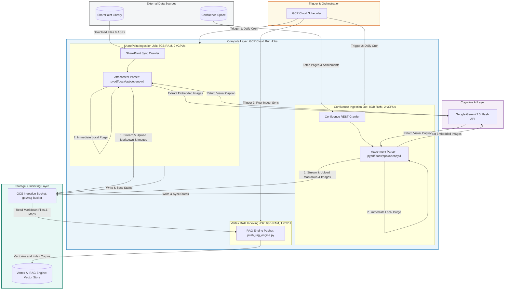
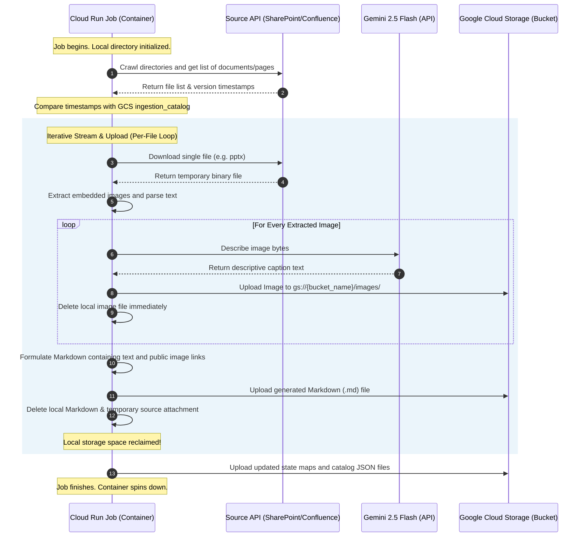
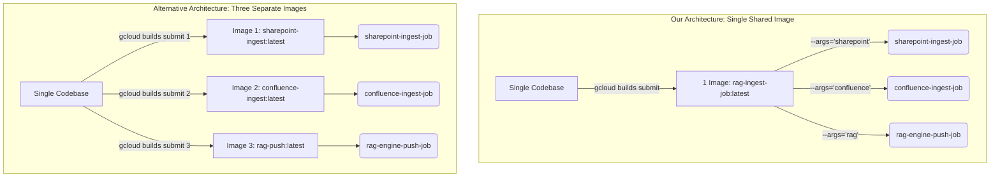

# RAG Ingestion Pipeline: Serverless Architecture Report

This document details the production-grade, highly-efficient, serverless RAG (Retrieval-Augmented Generation) ingestion architecture built on Google Cloud Platform (GCP). It includes details of the design, migration guidelines, and fixes applied to deploy the pipeline successfully across different GCP environments.

---

## 1. System Architecture Diagram

This Mermaid diagram illustrates the end-to-end data flow, resource provisioning, and interaction points between external data sources (SharePoint/Confluence), our serverless processing containers, AI services, and the final RAG storage layers.



---

## 2. Ingestion Cycle Flow

The following sequence highlights the transient, stream-and-upload lifecycle implemented to ensure **near-zero local storage footprint**, preventing Out-Of-Memory (OOM) and local disk saturation errors:



---

## 3. Key Design Pillars & Upgrades

### 🚀 High-Resource Serverless Compute
Rather than running in constrained environments (like local terminals, Cloud Shell containers with 5GB limits, or GitHub Actions with 7GB), the ingestion execution is offloaded to **GCP Cloud Run Jobs**. 
* **Right-Sized Task Instances:** Confluence and SharePoint crawlers run with **8GB of RAM and 2 vCPUs**, and a generous **1-hour timeout window**. 
* **Zero Idle Cost:** You only pay for the exact seconds the container executes. Once ingestion finishes, the container is destroyed, costing $0.

### 📦 Stream-and-Upload Pipeline (Memory & Disk Protection)
* **Immediate Purge:** Files, page attachments, and unzipped image streams are handled sequentially or in small parallel queues. As soon as a file is parsed or an image captioned, it is uploaded directly to GCS via the Python client and unlinked (`os.unlink`) from the disk.
* **Low Concurrent Headroom:** Concurrency is configured to `4` (using `SHAREPOINT_INGEST_CONCURRENCY=4`), avoiding heavy memory overhead on standard runs.

### 🌐 Hybrid CI/CD and Cloud Build
* **Google Cloud Build Integration:** Building the Docker container is executed entirely in the cloud via `gcloud builds submit`. This prevents heavy local CPU/RAM loads during image compilation.
* **Unified Codebase:** A single Dockerfile handles all scripts. The `run_job.sh` entrypoint behaves as an orchestrator, allowing the same container image to run SharePoint ingestion, Confluence ingestion, or Vertex AI RAG updates.

---

## 4. Fixes Applied to `deploy_cloud_run_job.sh`

The deployment script incorporates the following critical bug fixes to ensure it executes seamlessly:

### 🛠️ Isolated Build Context & Docker Image Optimization
* **Original Issue:** `gcloud builds submit` does not support `--file` or `--dockerfile` parameters to point to files in subdirectories (like `rag_agent/Dockerfile`). Specifying them caused immediate build rejections. Furthermore, launching the build context from the root workspace directory is a massive anti-pattern: it uploads unrelated agents (`code_review_agent`, `orchestrator_agent`, etc.) and huge local Python virtual environments (`venv/`, `rag_env/`) directly to Google Cloud Build, inflating container transfer size and slowing build compilation.
* **Fix Applied:** The script is optimized to run `gcloud builds submit` **directly inside the `rag_agent/` directory**. The build context is completely restricted to only the files inside `rag_agent/` (a few kilobytes instead of megabytes). To maintain Python import pathways (e.g., `from rag_agent.xxx import ...`), the Dockerfile is re-engineered to map `COPY . ./rag_agent/` inside the `/app` workspace directory. This guarantees that all namespace paths function flawlessly while securing and optimizing the container size.

### 🛠️ Escaping Errors in Environment Variables
* **Original Issue:** Passing comma-separated lists (e.g., `GEMINI_FALLBACK_MODELS="gemini-2.5-flash,gemini-3.5-flash"`) directly in `gcloud run jobs deploy --set-env-vars` caused `gcloud` to parse commas as delimiters, throwing errors or truncating values.
* **Fix Applied:** The script dynamically compiles the `.env` values into a clean YAML file (`env.yaml`) at runtime using a short, robust Python parsing helper. It then mounts all environment variables safely using `--env-vars-file=env.yaml`. This bypasses shell escaping/delimiter limits and handles complex strings natively.

---

## 5. Multi-Environment Migration Guide

To redeploy this ingestion infrastructure into a different GCP environment (e.g., Development, Staging, or Production), you must update the project-specific parameters described below.

### 🔍 Parameter Mapping

Open `rag_agent/deploy_cloud_run_job.sh` and customize the following configuration block:

| Parameter in Script | Current Configuration | Description | How to Configure for New Environment |
| :--- | :--- | :--- | :--- |
| **`REGION`** | `us-central1` | The target GCP region for Artifact Registry and Cloud Run. | Change to your target region (e.g., `us-east4` or `europe-west1`). |
| **`REPOSITORY`** | `rag-ingest-repo` | The name of the Docker artifact repository. | Keep as is, or rename to match your organizational naming rules. |
| **`IMAGE_NAME`** | `rag-ingest-job` | Name of the Docker image. | Keep as is, or rename if necessary. |
| **`NETWORK`** | `project-gebu-demo-sandbox-spoke-vpc` | The name of your Virtual Private Cloud (VPC). | **Required:** Change to the target project's spoke or hub VPC network name. |
| **`SUBNET`** | `project-gebu-demo-sandbox-spoke-vpc` | The specific VPC Subnetwork. | **Required:** Change to the target subnetwork name where Direct VPC egress is routed. |


### 🌐 Network Discovery Commands

To find the correct network and subnet parameters for your target environment, run the following `gcloud` CLI commands in your terminal:

```bash
# 1. Verify your active GCP project context
gcloud config get-value project

# 2. List all available VPC networks in the project
gcloud compute networks list

# 3. List all active subnets in your target region (e.g., us-central1)
gcloud compute networks subnets list --regions=us-central1

# 4. List all subnets across all regions (if unsure of the region)
gcloud compute networks subnets list

# 5. Show details of a specific subnet to confirm its range and state
gcloud compute networks subnets describe <SUBNET_NAME> --region=<REGION>
```

Use the output of these commands to populate the `NETWORK` and `SUBNET` parameters in the deployment script.

### 📋 Migration Steps

1. **Authentication:**
   Ensure your active terminal context is authenticated to the target GCP project and has billing enabled:
   ```bash
   gcloud auth login
   gcloud config set project YOUR_NEW_PROJECT_ID
   ```

2. **Set up Local Environment Variables (`.env`):**
   Copy `.env.example` to `.env` inside the new project's workspace, and update all target credentials, such as:
   - `GCP_PROJECT_ID`
   - `RAG_BUCKET_NAME` (Ensure this GCS bucket exists in the target project!)
   - `VERTEX_RAG_CORPUS_ID`
   - SharePoint / Confluence API credentials

3. **Update Direct VPC Networking Details:**
   If the target project does **not** enforce strict Direct VPC egress constraints (i.e. if it allows public routing), you can remove or comment out these flags from the deployment commands in the script:
   - `--network`
   - `--subnet`
   - `--vpc-egress`

   Otherwise, ensure that the target VPC and Subnet are correctly active in your destination project and match the values configured in `deploy_cloud_run_job.sh`.

4. **Execute the Deployment Script:**
   ```bash
   ./rag_agent/deploy_cloud_run_job.sh
   ```
   The script will:
   - Enable the Cloud Run, Cloud Build, and Artifact Registry APIs.
   - Provision the Artifact Registry repository.
   - Compile and upload the Docker container.
   - Deploy/Update all 3 Cloud Run Jobs automatically.

---

## 6. Cloud Run: Services vs. Jobs

When using Google Cloud Run, you can deploy your containerized workloads either as a **Service** or as a **Job**.

| Architectural Dimension | Cloud Run Service | Cloud Run Job |
| :--- | :--- | :--- |
| **Primary Workload Type** | **Request-Driven** (API, web app, webhooks). | **Task-Driven** (crawlers, batch scripts, migrations). |
| **Execution Model** | Listens on a designated HTTP port. Remains idle or scales to handle requests. | Starts upon trigger, runs until the script finishes (exit 0), then terminates. |
| **Port Listening** | **Required** (must bind to `$PORT` and receive HTTP/gRPC traffic). | **Prohibited** (fails if it opens a listening server socket). |
| **Max Timeout** | 60 minutes. | **24 hours** (ideal for high-capacity crawl cycles). |
| **Scaling Mechanism** | Automatic horizontal auto-scaling based on incoming requests. | Manual array of concurrent task slices (parallel processing). |

Our RAG crawlers (`confluence-ingest-job` and `sharepoint-ingest-job`) and push script (`rag-engine-push-job`) are **Cloud Run Jobs** because they run to completion, do not serve web request APIs, and need long execution limits (up to 1 hour or more) without timing out.

---

## 7. Understanding the Orchestration: Build vs. Job vs. Scheduler

To schedule your pipelines, it is crucial to understand the distinct roles of Google Cloud Build, Google Cloud Run, and Google Cloud Scheduler:

1. **Google Cloud Build (The Builder):**
   * **Role:** A compiler. It takes your source code from your local machine (or Git), processes the `Dockerfile`, compiles the container image, and pushes it to Artifact Registry.
   * **Frequency:** Run **only once** per code deployment. It is *not* what runs on a weekly schedule.
2. **Google Cloud Run Jobs (The Compute):**
   * **Role:** The serverless compute layer. It holds the executable code and configurations (Memory, CPU, environment variables).
   * **Frequency:** Run when triggered. It does not run continuously and has $0 active idle cost.
3. **Google Cloud Scheduler (The Trigger):**
   * **Role:** A serverless cron scheduler. It fires HTTP triggers at designated intervals (such as every Monday at midnight) to start the Cloud Run Jobs.
   * **Frequency:** Fully customizable using standard cron syntax (e.g., `0 0 * * 0` for weekly).

---

## 8. Step-by-Step Scheduling Guide (e.g., Weekly Once)

To configure your Cloud Run Jobs to run on a weekly schedule, follow these steps:

### Step 1: Create a Dedicated Service Account
Cloud Scheduler requires an IAM Service Account with permission to run Cloud Run Jobs.

```bash
# 1. Create the service account
gcloud iam service-accounts create rag-scheduler-sa \
    --display-name="RAG Pipeline Scheduler Service Account"

# 2. Grant the Cloud Run Invoker role to the service account
gcloud projects add-iam-policy-binding $(gcloud config get-value project) \
    --member="serviceAccount:rag-scheduler-sa@$(gcloud config get-value project).iam.gserviceaccount.com" \
    --role="roles/run.developer"
```

### Step 2: Create Scheduled Cron Triggers
Create a Google Cloud Scheduler job in the same region (e.g., `us-central1`) pointing to the Cloud Run REST API endpoint.

We use standard crontab expressions:
* `0 0 * * 0` (At midnight every Sunday — once a week)
* `0 2 * * *` (At 2:00 AM every night — once a day)

Run the following commands to schedule your 3 jobs:

```bash
# 1. Schedule SharePoint Ingestion (Every Sunday at 1:00 AM)
gcloud scheduler jobs create http sharepoint-weekly-ingest \
    --schedule="0 1 * * 0" \
    --uri="https://us-central1-run.googleapis.com/apis/run.googleapis.com/v1/namespaces/$(gcloud config get-value project)/jobs/sharepoint-ingest-job:run" \
    --http-method=POST \
    --oauth-service-account-email="rag-scheduler-sa@$(gcloud config get-value project).iam.gserviceaccount.com" \
    --location="us-central1"

# 2. Schedule Confluence Ingestion (Every Sunday at 2:00 AM)
gcloud scheduler jobs create http confluence-weekly-ingest \
    --schedule="0 2 * * 0" \
    --uri="https://us-central1-run.googleapis.com/apis/run.googleapis.com/v1/namespaces/$(gcloud config get-value project)/jobs/confluence-ingest-job:run" \
    --http-method=POST \
    --oauth-service-account-email="rag-scheduler-sa@$(gcloud config get-value project).iam.gserviceaccount.com" \
    --location="us-central1"

# 3. Schedule Vertex RAG Engine Synchronization (Every Sunday at 4:00 AM, post-ingestion)
gcloud scheduler jobs create http rag-engine-weekly-push \
    --schedule="0 4 * * 0" \
    --uri="https://us-central1-run.googleapis.com/apis/run.googleapis.com/v1/namespaces/$(gcloud config get-value project)/jobs/rag-engine-push-job:run" \
    --http-method=POST \
    --oauth-service-account-email="rag-scheduler-sa@$(gcloud config get-value project).iam.gserviceaccount.com" \
    --location="us-central1"
```

---

## 9. Troubleshooting Common Shell Errors

### ⚠️ Error: `-bash: --vpc-egress=all-traffic: command not found`
* **Why it happens:** This is a classic Bash shell syntax error. In Bash, the backslash (`\`) tells the interpreter to ignore the newline and continue reading the same command on the next line. If you place a line comment (`#`) in the middle of a command chain, **the backslash on the preceding line is broken**. Bash stops evaluating the main command, reads the commented line, and then treats the next line (`--vpc-egress=all-traffic`) as an entirely new standalone command, throwing `command not found`.
* **The Solution:** When commenting out arguments in a multi-line shell statement, you must remove the backslash (`\`) from the last active argument.
  
  *❌ Incorrect (Breaks continuation):*
  ```bash
  gcloud run jobs deploy my-job \
    --region="us-central1" \
  # --network="my-vpc" \
  # --subnet="my-subnet" \
    --vpc-egress=all-traffic
  ```
  *✔️ Correct (Commented out and cleanly terminated):*
  ```bash
  gcloud run jobs deploy my-job \
    --region="us-central1"
  ```

### ⚠️ Commenting Out VPC Parameters
* **Rule:** The `--vpc-egress` parameter has no meaning without a corresponding `--network` and `--subnet`. If you comment out `--network` and `--subnet` for environments that allow public egress, you **must also completely remove the `--vpc-egress` parameter**. Egress will automatically route through the public internet.

---

## 10. Simplified GCP Networking & Security Guide

If you are explaining this architecture to non-network engineers or preparing for migrations, use these simple, real-world analogies:

### 🏢 Analogy 1: VPC Firewall Rules (The Internal Security Guards)
* **What it is:** Security guards standing at the doors *inside* your corporate office building (your Private VPC).
* **How it works:** They control which departments (Subnets) can talk to other departments or private databases (VMs) inside the same building. For example, they allow the Accounting department to talk to the SQL Database on Port 1433, but block other departments.
* **Limitation:** They cannot control what happens outside the building (such as reading a public website or connecting to public Google Cloud Storage).

### 🏦 Analogy 2: VPC Service Controls / VPC-SC (The Security Fence around the Bank)
* **What it is:** A massive security perimeter fence built around Google’s shared services (like Google Cloud Storage buckets or Gemini AI APIs).
* **How it works:** To prevent data exfiltration, the fence blocks all access from the public internet. Even if a user has the vault key (IAM credentials), they are **rejected** if they try to access the service from a public coffee shop. They **must** enter through a secure, private corridor originating from inside your trusted corporate building (your authorized VPC).

### 🚶 Analogy 3: Direct VPC Egress (The Private Walkway)
* **What it is:** A secure, covered private corridor connecting a remote worker directly into your office building.
* **How it works:** By default, a Cloud Run Job is like a remote worker sitting in a public coffee shop (the public internet). When you configure `--network`, `--subnet`, and `--vpc-egress=all-traffic`, you are building a private walkway from Cloud Run directly into your private office subnet.
* **Result:** Now, the Cloud Run Job can reach private databases inside your office and can also make private calls to GCS/Gemini that comply with the bank's security fence (VPC-SC).

### 🚇 Analogy 4: Private Service Connect / PSC (The Private Tunnel)
* **What it is:** A private, secret underground tunnel inside your office building that leads directly to external services.
* **How it works:** PSC places a local, private IP address (e.g., `10.0.1.99`) right inside your subnet that maps directly to Google Services (like GCS or Gemini).
* **Combined Power:** When our Cloud Run Job walks down its private walkway (Direct VPC Egress) into your subnet, it can hop directly into the PSC underground tunnel to access GCS/Gemini. The traffic never once exits to the public internet, ensuring 100% airtight security.

---

## 11. Polymorphic Container Design (Single vs. Multi-Image Pattern)

This section details how the three independent ingestion jobs utilize a **single, unified container image** while performing completely different jobs, and why this is highly superior to compiling multiple containers.

### 🎯 Where is the Image Defined in the Deploy Script?

Inside [deploy_cloud_run_job.sh](file:///home/hemanth_gadavajhala/demo_agents/rag_agent/deploy_cloud_run_job.sh), the container registry and image parameters are defined in a single configuration block:

```bash
REGION="us-central1"
REPOSITORY="rag-ingest-repo"
IMAGE_NAME="rag-ingest-job"
IMAGE_PATH="${REGION}-docker.pkg.dev/${PROJECT_ID}/${REPOSITORY}/${IMAGE_NAME}:latest"
```

1. **One Artifact Tag:** The script builds and uploads exactly **one** image (`rag-ingest-job:latest`) to the Google Artifact Registry repository.
2. **Heavy Compilation Executed Once:** The script executes `gcloud builds submit --tag "$IMAGE_PATH" .` exactly once.
3. **Dynamic Parameterization:** When deploying the three separate Cloud Run Jobs, we reference the **exact same `$IMAGE_PATH`** via `--image "$IMAGE_PATH"`, but configure a custom argument string using `--args`:
   * **`sharepoint-ingest-job`** uses `--args="sharepoint"`
   * **`confluence-ingest-job`** uses `--args="confluence"`
   * **`rag-engine-push-job`** uses `--args="rag"`

This is called the **Polymorphic Container Pattern**. A single container image changes its shape (behavior) at runtime depending on the CLI arguments fed to it.

---

### ⚖️ Single Shared Image vs. Three Separate Images

If we wanted to compile and use three distinct containers for these three jobs, our workflow and orchestration would change as shown below:



#### Comparison of Architectural Dimensions:

| Dimension | Our Pattern: Polymorphic Image | Alternative: Three Separate Images |
| :--- | :--- | :--- |
| **Number of Build Commands** | **1** (`gcloud builds submit` runs once). | **3** (You must call `gcloud builds submit` 3 times on 3 distinct image paths). |
| **Artifact Repository Footprint** | **Minimal** (1 image with 1 set of layers). | **Large** (3 separate images repeating identical base OS layers and Python library dependencies). |
| **Build Time Overhead** | **Very Fast** (Only compile and transfer once, approx. 1-2 mins). | **Very Slow** (Must spin up three separate Cloud Build VMs, compile 3 times, adding 5-10 minutes of extra build overhead). |
| **Dependency Maintenance** | **Dead Simple** (Updating a library in `requirements.txt` compiles once, and all three jobs instantly receive it on next execution). | **Complex** (Library updates require running all three build chains to ensure versions remain aligned across jobs). |
| **Logical Execution** | Clean and unified. The runtime argument delegates internally. | Over-engineered. Added complexity with no performance benefits. |

### 🛠️ How Job Arguments work under the hood
When any Cloud Run Job runs, the entrypoint handler inside the Dockerfile processes the argument passed:
```bash
python -m rag_agent.run_job "$1"
```
The script reads `sys.argv[1]` (which is `sharepoint`, `confluence`, or `rag`) and dynamically executes the corresponding pipeline:
* If `sharepoint` -> Triggers `rag_agent/sharepoint_crawler.py`
* If `confluence` -> Triggers `rag_agent/confluence_crawler.py`
* If `rag` -> Triggers `rag_agent/push_rag_engine.py`

This ensures full runtime isolation of concerns while maintaining a lightweight, unified build and deploy pipeline.
