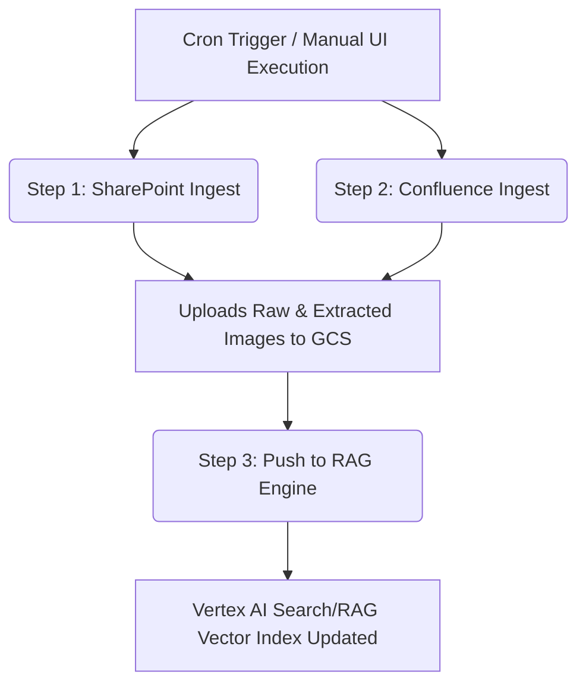

# Enterprise CI/CD Deployment Guide for RAG Ingestion Pipeline

This folder contains all configuration files required to automate your knowledge base ingestion (`Confluence` & `SharePoint`) and synchronize the outputs directly into your **Google Cloud Vertex AI RAG Engine**.

Integrating these steps into a scheduled pipeline ensures that your enterprise search indexes remain continuously up-to-date as documents are added, modified, or deleted inside your source libraries.

---

## 📋 Table of Contents
1. [Pipeline Architecture](#1-pipeline-architecture)
2. [Secrets Configuration Matrix](#2-secrets-configuration-matrix)
3. [Method A: Google Cloud Native Serverless (Recommended)](#method-a-google-cloud-native-serverless-recommended)
4. [Method B: GitHub Actions Pipeline](#method-b-github-actions-pipeline)
5. [Method C: GitLab CI/CD Pipeline](#method-c-gitlab-cicd-pipeline)
6. [Best Practices for Production](#6-best-practices-for-production)

---

## 1. Pipeline Architecture

The automated crawling process follows a 3-step execution flow:



To optimize performance and avoid high compute costs, the scripts utilize a local **Ingestion Cache State (`sharepoint_catalog.json` & `gcs_sharepoint_map.json`)** stored inside the GCS bucket. On every execution, the script downloads this state, compares it with live SharePoint/Confluence modifications, and **only processes new or modified items** — keeping execution times extremely short.

---

## 2. Secrets Configuration Matrix

Configure these variables inside your CI/CD Settings (GitHub Secrets / GitLab CI Variables) or inside **GCP Secret Manager** (if deploying natively to Cloud Run):

| Secret Name | Purpose | Example Value |
| :--- | :--- | :--- |
| `RAG_GCS_BUCKET_NAME` | The GCS bucket where RAG `.md` files are synchronized | `confluence-sharepoint-rag-bucket` |
| `GCP_PROJECT_ID` | Your Google Cloud Project ID | `my-enterprise-project-123` |
| `GCP_LOCATION` | Region of your Vertex Search / GCS bucket | `us-central1` |
| `RAG_ENGINE_ID` | The target Vertex RAG Engine instance ID | `1234567890123` |
| **Microsoft SharePoint Auth** | | |
| `SHAREPOINT_TENANT_ID` | Your Microsoft Azure Tenant ID | `3a5d89f8-...` |
| `SHAREPOINT_CLIENT_ID` | App Registration Client ID | `4a3b2c1d-...` |
| `SHAREPOINT_CLIENT_SECRET` | App Registration Client Secret | `_gH7q9~Jk...` |
| **Atlassian Confluence Auth** | | |
| `CONFLUENCE_URL` | Base Enterprise URL of Confluence | `https://company.atlassian.net` |
| `CONFLUENCE_USERNAME` | Technical/Service account login email | `service-user@company.com` |
| `CONFLUENCE_API_TOKEN` | Atlassian API Token generated for the service account | `ATATT3xFfGF0...` |
| `CONFLUENCE_SPACES` | Comma-separated list of Confluence Spaces to crawl | `ENG, SALES, OPS` |

---

## Method A: Google Cloud Native Serverless (Recommended)

Running the ingestion inside your GCP project is **strongly recommended** for production environments. It offers several benefits:
* **Zero Static Key Storage:** The pipeline executes using a GCP Service Account with IAM bindings — no need to save permanent GCP service account keys inside external CI/CD vaults.
* **Serverless Cost Efficiency:** The run executes inside a lightweight, ephemeral **Cloud Run Job**, which spins up on a schedule, completes in minutes, and is completely free of ongoing VM costs.

### How to Deploy Natively:
We have provided an automated deployment script: `cloud_run_job_deploy.sh`. 

1. Ensure your `gcloud` CLI is logged in and point it to your GCP project:
   ```bash
   gcloud config set project [YOUR_PROJECT_ID]
   ```
2. Navigate to the `cicd` folder and execute the deployer script:
   ```bash
   chmod +x cloud_run_job_deploy.sh
   ./cloud_run_job_deploy.sh
   ```

This script will:
* Enable required GCP APIs.
* Create a dedicated service account `rag-ingestion-executor` with minimum permissions (`storage.admin` & `discoveryengine.admin`).
* Trigger a **Google Cloud Build** job to package and containerize your python scripts.
* Create a **Cloud Run Job** configured to run your scripts.
* Configure a **Cloud Scheduler** job triggering a run daily at 2:00 AM.

---

## Method B: GitHub Actions Pipeline

If your codebase is hosted on GitHub, you can use the template located in: [github_action_ingest.yml](github_action_ingest.yml).

### Setup Steps:
1. Copy the `github_action_ingest.yml` file into your repository root at `.github/workflows/ingest_pipeline.yml`.
2. Add all variables in the **Secrets Matrix** to your GitHub repository under `Settings -> Secrets and variables -> Actions -> Repository Secrets`.
3. To configure authentications without using a long-lived GCP JSON key, set up **Workload Identity Federation** in GCP, copy the provider string, and save it in the secret variable `GCP_WORKLOAD_IDENTITY_PROVIDER`. (Alternatively, uncomment the static key step in the workflow and store `GCP_SA_KEY_JSON`).

---

## Method C: GitLab CI/CD Pipeline

For GitLab-based enterprise environments, use the template located in: [gitlab_ci_ingest.yml](gitlab_ci_ingest.yml).

### Setup Steps:
1. Append the contents of `gitlab_ci_ingest.yml` to your main `.gitlab-ci.yml` file, or include it directly.
2. In GitLab, navigate to `Settings -> CI/CD -> Variables` and add all variables in the **Secrets Matrix**.
3. Create a **Pipeline Schedule** in GitLab under `Build -> Pipeline Schedules` pointing to your desired cron intervals (e.g., `0 2 * * *` for daily at 2:00 AM) to automatically kick off the `run_rag_ingestion` job.

---

## 6. Best Practices for Production

1. **Leverage GCP Secret Manager:**
   To secure Atlassian and Microsoft client secrets, modify your container execution to retrieve secrets directly from **Google Cloud Secret Manager** at runtime using `google-cloud-secret-manager` instead of loading them as raw environment variables.
2. **Handle API Rate Throttling:**
   Both SharePoint (Microsoft Graph) and Confluence APIs implement strict rate limits. The crawler scripts are built with backoff-retry mechanisms and use a thread-safe semaphore (currently limited to `SHAREPOINT_INGEST_CONCURRENCY=5` and `gemini_semaphore` to 3 concurrent calls) to ensure you do not hit Atlassian or Microsoft rate-limiting blocks.
3. **Monitor Ingestion via Logs:**
   Cloud Run Jobs automatically sync all execution logging to **GCP Cloud Logging / Operations Suite**. You can set up an alerting policy to automatically page your team via email/Slack if the script reports `[Error] Parallel worker failed` or exit codes are non-zero.
