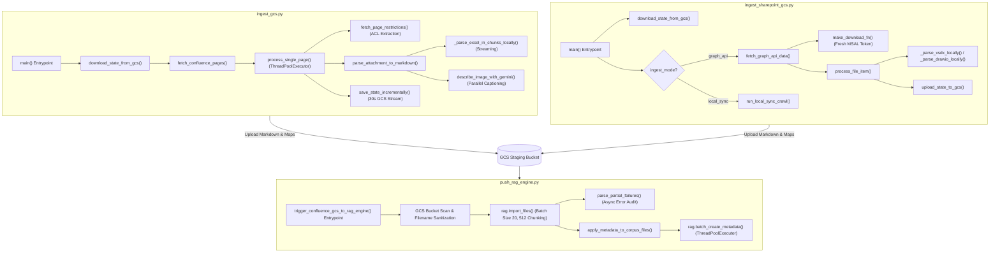
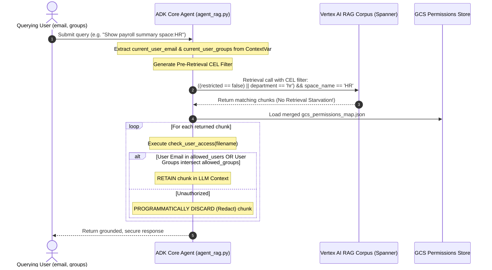

# Enterprise RAG Ingestion & Security Pipeline — Code-Wise Walkthrough Guide

This document provides an exhaustive, function-by-function, line-by-line code walkthrough of the core ingestion and RAG push scripts in the repository:
1. [`ingest_gcs.py`](file:///e:/GCP/HCL_Demos/demo_agents/rag_agent_rag_engine/rag_agent/ingest_gcs.py) — Confluence Cloud Crawler & Multimodal Enrichment Engine
2. [`ingest_sharepoint_gcs.py`](file:///e:/GCP/HCL_Demos/demo_agents/rag_agent_rag_engine/rag_agent/ingest_sharepoint_gcs.py) — SharePoint Graph API / Local Sync Crawler & Parser Engine
3. [`push_rag_engine.py`](file:///e:/GCP/HCL_Demos/demo_agents/rag_agent_rag_engine/rag_agent/push_rag_engine.py) — Vertex AI RAG Corpus Importer & Post-Sync Metadata Tagging Engine

It explains **where execution starts**, **how each data flow phase works in code**, and **how every optimization and robustness fix maps directly to specific functions and line numbers**.

---

## 📖 Quick Summary: Executive Code Architecture Map



---

## 1. Confluence Ingestion (`ingest_gcs.py`) — Deep Code Walkthrough

### 🚀 Starting Point of Execution
Execution starts at the standard Python entrypoint at the very bottom of the file:
```python
# Lines 1937-1938
if __name__ == "__main__":
    main()
```

### Step 1: Entrypoint & Stateless State Synchronization
*   **Function**: [`main()`](file:///e:/GCP/HCL_Demos/demo_agents/rag_agent_rag_engine/rag_agent/ingest_gcs.py#L1726-L1935)
*   **Lines**: `1726 - 1798`
*   **Code Mechanics**:
    1. Reads environment configuration (`RAG_GCS_BUCKET_NAME`, `CONFLUENCE_URL`, `CONFLUENCE_USERNAME`, `CONFLUENCE_API_TOKEN`, `FORCE_REINGEST`).
    2. Initializes local paths for state tracking:
       - [`ingestion_catalog.json`](file:///e:/GCP/HCL_Demos/demo_agents/rag_agent_rag_engine/rag_agent/ingest_gcs.py#L1737): Tracks processed page/attachment IDs, titles, and version numbers.
       - [`gcs_confluence_map.json`](file:///e:/GCP/HCL_Demos/demo_agents/rag_agent_rag_engine/rag_agent/ingest_gcs.py#L1738): Maps GCS markdown filenames to their original Confluence web URLs for UI citation.
       - [`gcs_confluence_permissions_map.json`](file:///e:/GCP/HCL_Demos/demo_agents/rag_agent_rag_engine/rag_agent/ingest_gcs.py#L1739): Holds crawled ACL restrictions and space metadata.
    3. Calls [`download_state_from_gcs()`](file:///e:/GCP/HCL_Demos/demo_agents/rag_agent_rag_engine/rag_agent/ingest_gcs.py#L1024-L1041) (lines `1024-1041`):
       ```python
       # Lines 1028-1031
       download_file_from_gcs(f"gs://{bucket_name}/ingestion_catalog.json", str(local_catalog_path))
       download_file_from_gcs(f"gs://{bucket_name}/gcs_confluence_map.json", str(local_map_path))
       download_file_from_gcs(f"gs://{bucket_name}/gcs_confluence_permissions_map.json", str(local_perm_path))
       ```
       *Why this matters for client*: This makes Cloud Run containers **100% stateless**. When a container starts up fresh, it downloads the previous state from GCS so it never re-processes unchanged documents.
    4. Initializes the Google GenAI SDK client via [`get_gemini_client()`](file:///e:/GCP/HCL_Demos/demo_agents/rag_agent_rag_engine/rag_agent/ingest_gcs.py#L267-L286) (lines `267-286`) with a 60-second timeout to prevent hangs.

---

### Step 2: Space Discovery & Authentication Gateway
*   **Function**: [`fetch_confluence_pages()`](file:///e:/GCP/HCL_Demos/demo_agents/rag_agent_rag_engine/rag_agent/ingest_gcs.py#L1411-L1697)
*   **Lines**: `1411 - 1491`
*   **Code Mechanics**:
    1. **OAuth 2.0 Client Credentials Exchange**: If `CONFLUENCE_OAUTH_CLIENT_ID` and `SECRET` are set, calls [`_get_oauth_access_token()`](file:///e:/GCP/HCL_Demos/demo_agents/rag_agent_rag_engine/rag_agent/ingest_gcs.py#L972-L985) (lines `972-985`) to fetch a machine-to-machine access token.
    2. **Cloud ID Resolution**: Calls [`_get_cloud_id()`](file:///e:/GCP/HCL_Demos/demo_agents/rag_agent_rag_engine/rag_agent/ingest_gcs.py#L988-L1021) (lines `988-1021`) to construct Atlassian's OAuth API gateway URL (`https://api.atlassian.com/ex/confluence/{cloud_id}/rest/api`).
    3. **Space Fetching & Filtering**: Queries `/space` API (lines `1464-1480`). If the `CONFLUENCE_SPACES` environment variable is provided (e.g. `BMEP,HR`), it filters the targeted spaces.

---

### Step 3: Rapid Page Metadata Discovery & Rate-Limit Retry Resilience
*   **Function**: [`fetch_confluence_pages()`](file:///e:/GCP/HCL_Demos/demo_agents/rag_agent_rag_engine/rag_agent/ingest_gcs.py#L1493-L1563)
*   **Lines**: `1493 - 1563`
*   **Code Mechanics**:
    1. Loops through each space and fetches page headers (`/content?spaceKey={key}&expand=body.storage,version`).
    2. **Exponential Backoff Retry Loop** (lines `1506-1541`):
       ```python
       for attempt in range(retries):
           try:
               pages_resp = httpx.get(..., timeout=90)
               pages_resp.raise_for_status()
               data = pages_resp.json()
               break
           except httpx.HTTPStatusError as http_err:
               if http_err.response.status_code == 429:
                   retry_after = int(http_err.response.headers.get("Retry-After", backoff * (attempt + 1)))
                   time.sleep(retry_after)
       ```
       *Why this matters for client*: Prevents network timeouts or temporary Confluence API throttling (`HTTP 429`) from failing the ingestion job.

---

### Step 4: Defensive Guardrails for Data Deletion
*   **Function**: [`fetch_confluence_pages()`](file:///e:/GCP/HCL_Demos/demo_agents/rag_agent_rag_engine/rag_agent/ingest_gcs.py#L1564-L1631)
*   **Lines**: `1564 - 1631`
*   **Code Mechanics**:
    Before syncing deletions from GCS, two **Defensive Guardrails** check for system anomalies:
    1. **Guardrail 1 (API Error Protection, lines `1571-1578`)**: If `has_fetch_errors` is true, delete sync is **auto-paused** so partial network failures don't wipe out existing files.
    2. **Guardrail 2 (Service Account Expiration Protection, lines `1581-1590`)**: If the API returns 0 pages but the catalog has >10 existing pages, delete sync is **auto-paused** with a `CRITICAL SAFETY WARNING`. This protects against credential expiration wiping out the database.
    3. If valid deletions exist, calls [`delete_file_from_gcs()`](file:///e:/GCP/HCL_Demos/demo_agents/rag_agent_rag_engine/rag_agent/ingest_gcs.py#L234-L265) (lines `1608-1628`) to purge deleted pages and their attachments from GCS.

---

### Step 5: Multi-Threaded Ingestion & Incremental Cache Skipping
*   **Function**: [`fetch_confluence_pages()`](file:///e:/GCP/HCL_Demos/demo_agents/rag_agent_rag_engine/rag_agent/ingest_gcs.py#L1633-L1697) & [`process_single_page()`](file:///e:/GCP/HCL_Demos/demo_agents/rag_agent_rag_engine/rag_agent/ingest_gcs.py#L1058-L1409)
*   **Lines**: `1058 - 1108` & `1633 - 1697`
*   **Code Mechanics**:
    1. Uses a `ThreadPoolExecutor` (lines `1640-1657`) with concurrency set by `CONFLUENCE_INGEST_CONCURRENCY` (default 3).
    2. **Crawl-Time Access Control Extraction**:
       Calls [`fetch_page_restrictions()`](file:///e:/GCP/HCL_Demos/demo_agents/rag_agent_rag_engine/rag_agent/ingest_gcs.py#L32-L70) (lines `32-70` & `1088-1090`):
       ```python
       permissions = fetch_page_restrictions(base_api, page_id, auth, headers)
       # Hits /content/{page_id}/restriction/byOperation
       # Returns: {"restricted": bool, "allowed_users": [...], "allowed_groups": [...]}
       ```
    3. **Incremental Cache Check** (lines `1097-1107`):
       Compares Confluence `version_num` against `catalog[catalog_key]`. If unmodified and attachments were fully processed, it returns immediately without downloading or parsing!

---

### Step 6: Multimodal Parsing & Inline Image Captioning
*   **Function**: [`process_single_page()`](file:///e:/GCP/HCL_Demos/demo_agents/rag_agent_rag_engine/rag_agent/ingest_gcs.py#L1115-L1245)
*   **Lines**: `1115 - 1245`
*   **Code Mechanics**:
    1. **Parallel Inline Image Captioning**:
       Scans storage XHTML for `<ac:image>` tags (lines `1116-1126`), downloading image bytes and calling `_replace_image_tag_thread()` across 5 worker threads.
    2. **Gemini Captioning with Exponential Backoff**:
       Calls [`describe_image_with_gemini()`](file:///e:/GCP/HCL_Demos/demo_agents/rag_agent_rag_engine/rag_agent/ingest_gcs.py#L288-L326) (lines `288-326`):
       - Filters tiny graphics (`< 15 KB`).
       - Sends image bytes to `gemini-2.5-flash` wrapped inside [`gemini_semaphore`](file:///e:/GCP/HCL_Demos/demo_agents/rag_agent_rag_engine/rag_agent/ingest_gcs.py#L22) (limits concurrent calls to 3).
       - Retries up to 5 times on `429 Rate Limit` errors with exponential backoff and jitter (lines `317-320`).
       - Uploads image to `gs://{bucket_name}/images/{safe_name}`.
    3. **HTML Table to Markdown Converter**:
       Calls [`_convert_html_tables_to_markdown()`](file:///e:/GCP/HCL_Demos/demo_agents/rag_agent_rag_engine/rag_agent/ingest_gcs.py#L347-L410) (lines `347-410`) using BeautifulSoup to turn standard HTML `<table>` elements into Markdown pipe tables.
    4. **XHTML Stripper**:
       Calls [`_strip_html()`](file:///e:/GCP/HCL_Demos/demo_agents/rag_agent_rag_engine/rag_agent/ingest_gcs.py#L328-L345) (lines `328-345`) to remove remaining XML tags.

---

### Step 7: Attachment Processing, Memory-Safety & Hybrid Parsing
*   **Function**: [`download_attachment()`](file:///e:/GCP/HCL_Demos/demo_agents/rag_agent_rag_engine/rag_agent/ingest_gcs.py#L412-L497) & [`parse_attachment_to_markdown()`](file:///e:/GCP/HCL_Demos/demo_agents/rag_agent_rag_engine/rag_agent/ingest_gcs.py#L837-L970)
*   **Lines**: `412 - 497`, `698 - 834`, `837 - 970`
*   **Code Mechanics**:
    1. **Streaming Chunked Download**:
       `download_attachment()` streams files in 8KB chunks (`r.iter_bytes(8192)`). Checks file size on-the-fly and aborts if it exceeds `CONFLUENCE_MAX_FILE_SIZE_MB` (default 500MB).
    2. **Excel Memory-Safe Streaming Chunk-Splitter**:
       Calls [`_parse_excel_in_chunks_locally()`](file:///e:/GCP/HCL_Demos/demo_agents/rag_agent_rag_engine/rag_agent/ingest_gcs.py#L734-L819) (lines `734-819`). Uses `openpyxl` with `read_only=True` to stream sheet rows without loading the entire spreadsheet into memory. Yields 500-row chunks as virtual documents (`Part 1`, `Part 2`), preventing Cloud Run container **Exit Code 137 OOM crashes**.
    3. **CSV Streaming Chunk-Splitter**:
       Calls [`_parse_csv_in_chunks_locally()`](file:///e:/GCP/HCL_Demos/demo_agents/rag_agent_rag_engine/rag_agent/ingest_gcs.py#L698-L729) (lines `698-729`) using `pandas` with `chunksize=500`.
    4. **Searchable PDF Detection & Hybrid Routing**:
       Calls [`_is_pdf_searchable()`](file:///e:/GCP/HCL_Demos/demo_agents/rag_agent_rag_engine/rag_agent/ingest_gcs.py#L821-L834) (lines `821-834`). If a PDF has selectable text, it parses locally via PyPDF (`_parse_pdf_locally()`, lines `621-634`), saving Gemini API cost and latency. If scanned, it routes to Gemini Multimodal OCR (lines `883-912`).
    5. **Local Fallback Parsers**:
       If Gemini API fails or rate-limits, seamlessly falls back to [`_parse_docx_locally()`](file:///e:/GCP/HCL_Demos/demo_agents/rag_agent_rag_engine/rag_agent/ingest_gcs.py#L500-L562) or [`_parse_pptx_locally()`](file:///e:/GCP/HCL_Demos/demo_agents/rag_agent_rag_engine/rag_agent/ingest_gcs.py#L565-L617).
    6. **Embedded Image Extraction**:
       Calls [`extract_images_from_attachment()`](file:///e:/GCP/HCL_Demos/demo_agents/rag_agent_rag_engine/rag_agent/ingest_gcs.py#L637-L695) to extract embedded images from Word/PDFs/PPTs and caption them in parallel.

---

### Step 8: Document Enrichment & Incremental Progress Streaming
*   **Function**: [`save_and_upload_markdown_doc()`](file:///e:/GCP/HCL_Demos/demo_agents/rag_agent_rag_engine/rag_agent/ingest_gcs.py#L72-L116) & [`save_state_incrementally()`](file:///e:/GCP/HCL_Demos/demo_agents/rag_agent_rag_engine/rag_agent/ingest_gcs.py#L118-L142)
*   **Lines**: `72 - 142`
*   **Code Mechanics**:
    1. **Text-Embedded Metadata Block**: Injects metadata header at top of file (lines `90-101`):
       ```text
       source_url: https://lumen.atlassian.net/wiki/spaces/BMEP/pages/123456
       title: Project Connect Deployment Plan
       source_system: Confluence
       restricted: True
       allowed_groups: HR_TEAM,EXEC_BOARD
       allowed_users: hr_manager@company.com
       ```
    2. Uploads `.md` to GCS `gs://{bucket_name}/{filename}` via [`upload_file_to_gcs()`](file:///e:/GCP/HCL_Demos/demo_agents/rag_agent_rag_engine/rag_agent/ingest_gcs.py#L164-L193).
    3. Thread-safely updates `gcs_confluence_permissions_map` under [`state_lock`](file:///e:/GCP/HCL_Demos/demo_agents/rag_agent_rag_engine/rag_agent/ingest_gcs.py#L25) (line `1249`).
    4. **Throttled State Upload** (lines `135-139`): Uploads state files (`ingestion_catalog.json`, `gcs_confluence_permissions_map.json`) to GCS every **30 seconds**. This guarantees that even if Cloud Run times out after 4 hours, all completed work is saved and the next run resumes instantly!
    5. **Failure Report Upload** (lines `1924-1930`): Writes exceptions to `gcs_confluence_failure_results.json` and syncs to GCS.

---

## 2. SharePoint Ingestion (`ingest_sharepoint_gcs.py`) — Deep Code Walkthrough

### 🚀 Starting Point of Execution
Execution starts at line 1937:
```python
# Lines 1937-1938
if __name__ == "__main__":
    main()
```

### Step 1: Entrypoint & Mode Selection
*   **Function**: [`main()`](file:///e:/GCP/HCL_Demos/demo_agents/rag_agent_rag_engine/rag_agent/ingest_sharepoint_gcs.py#L1801-L1938)
*   **Lines**: `1801 - 1888`
*   **Code Mechanics**:
    1. Downloads state from GCS (`download_state_from_gcs()`, lines `82-119`) for [`sharepoint_catalog.json`](file:///e:/GCP/HCL_Demos/demo_agents/rag_agent_rag_engine/rag_agent/ingest_sharepoint_gcs.py#L1821), [`gcs_sharepoint_map.json`](file:///e:/GCP/HCL_Demos/demo_agents/rag_agent_rag_engine/rag_agent/ingest_sharepoint_gcs.py#L1822), and [`gcs_sharepoint_permissions_map.json`](file:///e:/GCP/HCL_Demos/demo_agents/rag_agent_rag_engine/rag_agent/ingest_sharepoint_gcs.py#L1823).
    2. Initializes Gemini Client.
    3. Reads `SHAREPOINT_INGEST_MODE`:
       - `"graph_api"` (Method B): Remote Microsoft Graph API crawler (`fetch_graph_api_data()`, lines `1428-1798`).
       - `"local_sync"` (Method A): Synced folder crawler (`run_local_sync_crawl()`, lines `1317-1425`).
    4. Calls [`get_msal_token()`](file:///e:/GCP/HCL_Demos/demo_agents/rag_agent_rag_engine/rag_agent/ingest_sharepoint_gcs.py#L1050-L1120) to acquire a Microsoft Entra ID OAuth token via MSAL ConfidentialClientApplication.

---

### Step 2: Site Discovery & Permission Error Diagnostics
*   **Function**: [`fetch_graph_api_data()`](file:///e:/GCP/HCL_Demos/demo_agents/rag_agent_rag_engine/rag_agent/ingest_sharepoint_gcs.py#L1428-L1507)
*   **Lines**: `1428 - 1507`
*   **Code Mechanics**:
    1. **Flexible Discovery Paths**:
       - `SHAREPOINT_SINGLE_SITE_PATH`: Targets a single site path directly (`/sites/YourApplicationSite`).
       - `SHAREPOINT_SITES_LIST`: Direct whitelist to bypass global search.
       - `SHAREPOINT_SITE_SEARCH_QUERY`: Global search query (defaults to `*`).
    2. **403 Diagnostic Logger** (lines `1490-1494`):
       If global search fails with `HTTP 403 Forbidden`, logs a helpful diagnostic message explaining that tenant-wide `Sites.Read.All` is missing and advising the client to list paths in `SHAREPOINT_SITES_LIST`.

---

### Step 3: Document Library Traversal & Long-Crawl Token Protection
*   **Function**: [`fetch_graph_api_data()`](file:///e:/GCP/HCL_Demos/demo_agents/rag_agent_rag_engine/rag_agent/ingest_sharepoint_gcs.py#L1512-L1712)
*   **Lines**: `1512 - 1712`
*   **Code Mechanics**:
    1. Loops through sites and fetches Document Libraries (`/sites/{site_id}/drives`).
    2. Uses a **Queue-Based Recursive Traversal** (`folder_queue = [("root", "")]`, lines `1606-1707`) to discover nested subfolders.
    3. **Long-Crawl Token Expiration Protection** ([`make_download_fn()`](file:///e:/GCP/HCL_Demos/demo_agents/rag_agent_rag_engine/rag_agent/ingest_sharepoint_gcs.py#L1512-L1584), lines `1522-1526`):
       ```python
       # Dynamically acquire a fresh access token to prevent 401 expiration errors during long crawls
       fresh_token = get_msal_token()
       if fresh_token:
           req_headers = {"Authorization": f"Bearer {fresh_token}"}
       ```
       *Why this matters for client*: SharePoint Graph API tokens expire after 60 minutes. During a 3-hour crawl, standard scripts fail with `401 Unauthorized`. Our factory dynamically refreshes the token on-the-fly!

---

### Step 4: SharePoint Specialized File Parsers
*   **Function**: [`parse_attachment_to_markdown()`](file:///e:/GCP/HCL_Demos/demo_agents/rag_agent_rag_engine/rag_agent/ingest_sharepoint_gcs.py#L641-L815)
*   **Lines**: `347 - 433`, `731 - 763`
*   **Code Mechanics**:
    1. **Visio Diagram Parser** ([`_parse_vsdx_locally()`](file:///e:/GCP/HCL_Demos/demo_agents/rag_agent_rag_engine/rag_agent/ingest_sharepoint_gcs.py#L347-L379), lines `347-379`): Unzips `.vsdx` files, parses XML page nodes (`visio/pages/page*.xml`), and extracts shape text labels.
    2. **Draw.io Diagram Parser** ([`_parse_drawio_locally()`](file:///e:/GCP/HCL_Demos/demo_agents/rag_agent_rag_engine/rag_agent/ingest_sharepoint_gcs.py#L381-L433), lines `381-433`): Decompresses base64 + zlib compressed Draw.io XML `<diagram>` nodes, unescapes HTML entities, and extracts cell labels.
    3. **ASPX SitePage Parser** (lines `743-762`): Parses SharePoint SitePage HTML into clean text using BeautifulSoup.
    4. Calls `_parse_excel_in_chunks_locally()` and `_parse_csv_in_chunks_locally()` for memory-safe spreadsheet processing.

---

### Step 5: Parallel Worker Processing & State Upload
*   **Function**: [`process_file_item()`](file:///e:/GCP/HCL_Demos/demo_agents/rag_agent_rag_engine/rag_agent/ingest_sharepoint_gcs.py#L1125-L1314) & [`fetch_graph_api_data()`](file:///e:/GCP/HCL_Demos/demo_agents/rag_agent_rag_engine/rag_agent/ingest_sharepoint_gcs.py#L1714-L1797)
*   **Lines**: `1125 - 1314` & `1714 - 1797`
*   **Code Mechanics**:
    1. Hashes drive/item IDs to create unique, safe filenames.
    2. Extracts SharePoint site metadata (`site_name`).
    3. Generates enriched Markdown file with metadata block.
    4. Uploads `.md` to GCS `gs://{bucket_name}/{filename}`.
    5. Updates `gcs_sharepoint_permissions_map.json` and streams state to GCS every 30 seconds (lines `1764-1782`).
    6. Writes any worker failures to `gcs_sharepoint_failure_results.json` and uploads to GCS (lines `1923-1930`).

---

## 3. RAG Push & Metadata Tagging (`push_rag_engine.py`) — Deep Code Walkthrough

### 🚀 Starting Point of Execution
Execution starts at line 607:
```python
# Lines 607-608
if __name__ == "__main__":
    trigger_confluence_gcs_to_rag_engine()
```

### Step 1: Entrypoint & Vertex AI Corpus Initialization
*   **Function**: [`trigger_confluence_gcs_to_rag_engine()`](file:///e:/GCP/HCL_Demos/demo_agents/rag_agent_rag_engine/rag_agent/push_rag_engine.py#L242-L400)
*   **Lines**: `242 - 282`
*   **Code Mechanics**:
    1. Loads environment configuration (`GOOGLE_CLOUD_PROJECT`, `GOOGLE_CLOUD_LOCATION`, `RAG_CORPUS_ID`, `RAG_GCS_BUCKET_NAME`).
    2. Initializes Vertex AI SDK:
       ```python
       # Line 262
       retry_api_call(vertexai.init, project=project_id, location=location)
       ```
    3. **Optional Clean Purge**: If `FORCE_REINGEST` is true, calls [`get_all_corpus_files()`](file:///e:/GCP/HCL_Demos/demo_agents/rag_agent_rag_engine/rag_agent/push_rag_engine.py#L45-L123) and deletes existing corpus files for a fresh sync.

---

### Step 2: GCS File Discovery & Filename Sanitization
*   **Function**: [`trigger_confluence_gcs_to_rag_engine()`](file:///e:/GCP/HCL_Demos/demo_agents/rag_agent_rag_engine/rag_agent/push_rag_engine.py#L284-L320)
*   **Lines**: `284 - 320`
*   **Code Mechanics**:
    1. Scans `gs://{bucket_name}/` using `gcloud storage ls`.
    2. Skips `images/` directory (binary files) and non-markdown files.
    3. **Filename Sanitization** (lines `303-308`):
       ```python
       if "'" in obj_name or "`" in obj_name:
           print(f"  -> Removing problematic file: {obj_name}")
           subprocess.run(["gcloud", "storage", "rm", obj_uri], check=True)
       ```
       *Why this matters for client*: Single quotes `'` or backticks `` ` `` in filenames cause Vertex AI RAG import API calls to crash. Sanitization removes them before import.

---

### Step 3: Rate-Limited Batch Import & Layout-Aware Chunking
*   **Function**: [`trigger_confluence_gcs_to_rag_engine()`](file:///e:/GCP/HCL_Demos/demo_agents/rag_agent_rag_engine/rag_agent/push_rag_engine.py#L321-L387)
*   **Lines**: `321 - 387`
*   **Code Mechanics**:
    1. Batches GCS file URIs in groups of 20 (respecting the 25 GCS URIs per call API limit).
    2. **API Retry Wrapper** ([`retry_api_call()`](file:///e:/GCP/HCL_Demos/demo_agents/rag_agent_rag_engine/rag_agent/push_rag_engine.py#L20-L43), lines `20-43`):
       Catches `ResourceExhausted` / `429 Rate Limit` errors and applies exponential backoff with random jitter.
    3. **RAG Import Configuration** (lines `333-339`):
       ```python
       response = retry_api_call(
           rag.import_files,
           corpus_name=corpus_name,
           paths=batch,
           chunk_size=512,
           chunk_overlap=100,
           max_embedding_requests_per_min=900,
       )
       ```
       - `chunk_size = 512`: Sets exact token limit per chunk.
       - `chunk_overlap = 100`: Ensures semantic continuity across boundary splits.
       - `max_embedding_requests_per_min = 900`: Enforces safe rate limit pacing.
       - **Layout-Aware Chunking**: Vertex AI RAG Engine natively parses Markdown headings (`#`), lists, and double newlines (`\n\n`) as semantic chunk boundaries, ensuring tables and paragraphs are kept intact.

---

### Step 4: Asynchronous Partial Failures Auditor
*   **Function**: [`parse_partial_failures()`](file:///e:/GCP/HCL_Demos/demo_agents/rag_agent_rag_engine/rag_agent/push_rag_engine.py#L170-L240) & [`save_push_failures()`](file:///e:/GCP/HCL_Demos/demo_agents/rag_agent_rag_engine/rag_agent/push_rag_engine.py#L147-L168)
*   **Lines**: `147 - 240` & `345 - 382`
*   **Code Mechanics**:
    1. If `failed_rag_files_count > 0`, retrieves `response.partial_failures_gcs_path`.
    2. Downloads and parses the Vertex AI failure log using `gcloud storage cat`.
    3. Handles both JSON and CSV error schemas, extracting filename, error code, and error message.
    4. Writes results to `gs://{bucket}/gcs_push_rag_failure_results.json`.

---

### Step 5: Post-Sync Database Metadata Tagging
*   **Function**: [`apply_metadata_to_corpus_files()`](file:///e:/GCP/HCL_Demos/demo_agents/rag_agent_rag_engine/rag_agent/push_rag_engine.py#L402-L605)
*   **Lines**: `402 - 605`
*   **Code Mechanics**:
    1. Downloads `gcs_confluence_permissions_map.json` and `gcs_sharepoint_permissions_map.json` from GCS.
    2. Downloads `metadata_tagged_catalog.json` from GCS to skip files tagged in previous runs.
    3. Fetches all corpus files via [`get_all_corpus_files()`](file:///e:/GCP/HCL_Demos/demo_agents/rag_agent_rag_engine/rag_agent/push_rag_engine.py#L45-L123) (lines `45-123`).
       *Robustness fix*: Safely handles both `ListRagFilesPager` and `ListRagFilesResponse` SDK return types to prevent `'object is not iterable'` errors.
    4. **Single Key-Value Pair Constraint Handling** (lines `505-534`):
       Vertex AI RAG API enforces a strict constraint that each `UserSpecifiedMetadata` object can hold **only one** key-value pair. The code constructs separate `UserSpecifiedMetadata` objects for each field:
       ```python
       requests = []
       # 1. restricted
       user_metadata_restricted = rag.UserSpecifiedMetadata(
           values={"restricted": rag.MetadataValue(bool_value=restricted)}
       )
       requests.append(rag.RagMetadata(user_specified_metadata=user_metadata_restricted))

       # 2. source_system
       user_metadata_sys = rag.UserSpecifiedMetadata(
           values={"source_system": rag.MetadataValue(string_value=source_system)}
       )
       requests.append(rag.RagMetadata(user_specified_metadata=user_metadata_sys))

       # 3. space_name / site_name
       if space_name:
           user_metadata_space = rag.UserSpecifiedMetadata(
               values={"space_name": rag.MetadataValue(string_value=space_name)}
           )
           requests.append(rag.RagMetadata(user_specified_metadata=user_metadata_space))

       # Execute unified batch call
       rag.batch_create_metadata(corpus_name=corpus_name, file_name=rag_file.name, requests=requests)
       ```
    5. Runs tagging across 5 worker threads (`ThreadPoolExecutor(max_workers=5)`).
    6. Saves progress to `metadata_tagged_catalog.json` on GCS every 100 files.

---

## 4. How Crawled ACL Permissions Enable Query-Time Redaction

The permission metadata extracted during crawl-time in Phase 1 & 2 flows directly into Phase 3 and runtime retrieval:



1. **Crawl-Time Metadata**: `ingest_gcs.py` and `ingest_sharepoint_gcs.py` query source APIs to build `gcs_confluence_permissions_map.json` and `gcs_sharepoint_permissions_map.json`.
2. **Post-Sync Database Tagging**: `push_rag_engine.py` tags corpus files with `restricted`, `source_system`, `space_name`, and `site_name`.
3. **Layer 1: Pre-Retrieval CEL Filtering ([`agent_rag.py`](file:///e:/GCP/HCL_Demos/demo_agents/rag_agent_rag_engine/rag_agent/agent_rag.py))**:
   At retrieval time, the agent constructs a CEL filter statement before querying Spanner. This filters out unauthorized files *at the database layer*, eliminating the "Top-K Deficit / Retrieval Starvation" problem.
4. **Layer 2: Thread-Safe Post-Retrieval Redaction**:
   For any returned chunk, `check_user_access()` inspects the thread-local `contextvars` (`current_user_email`, `current_user_groups`). If the user does not have access, the chunk text is programmatically discarded before reaching Gemini, guaranteeing complete enterprise data safety.

---

## 5. Architectural Feature & Optimization Mapping Table

| Feature / Benefit | Primary Script | Function Name | Exact Line Numbers | Technical Summary & Purpose |
| :--- | :--- | :--- | :--- | :--- |
| **Stateless Container State Download** | `ingest_gcs.py` | [`download_state_from_gcs()`](file:///e:/GCP/HCL_Demos/demo_agents/rag_agent_rag_engine/rag_agent/ingest_gcs.py#L1024) | [`L1024 - L1041`](file:///e:/GCP/HCL_Demos/demo_agents/rag_agent_rag_engine/rag_agent/ingest_gcs.py#L1024-L1041) | Downloads catalog and URL maps from GCS on startup so container runs statelessly across Cloud Run tasks. |
| **Incremental State Streaming (30s)** | `ingest_gcs.py` | [`save_state_incrementally()`](file:///e:/GCP/HCL_Demos/demo_agents/rag_agent_rag_engine/rag_agent/ingest_gcs.py#L118) | [`L118 - L142`](file:///e:/GCP/HCL_Demos/demo_agents/rag_agent_rag_engine/rag_agent/ingest_gcs.py#L118-L142) | Uploads progress state to GCS every 30s so 4-hour Cloud Run timeouts resume seamlessly on next trigger. |
| **Defensive Delete Safety Guardrails** | `ingest_gcs.py` | [`fetch_confluence_pages()`](file:///e:/GCP/HCL_Demos/demo_agents/rag_agent_rag_engine/rag_agent/ingest_gcs.py#L1411) | [`L1571 - L1591`](file:///e:/GCP/HCL_Demos/demo_agents/rag_agent_rag_engine/rag_agent/ingest_gcs.py#L1571-L1591) | Auto-pauses GCS file purges if API errors occur or 0 pages are returned due to service account expiration. |
| **Crawl-Time Confluence ACL Extraction** | `ingest_gcs.py` | [`fetch_page_restrictions()`](file:///e:/GCP/HCL_Demos/demo_agents/rag_agent_rag_engine/rag_agent/ingest_gcs.py#L32) | [`L32 - L70`](file:///e:/GCP/HCL_Demos/demo_agents/rag_agent_rag_engine/rag_agent/ingest_gcs.py#L32-L70) | Queries Confluence restrictions API to extract `allowed_users`, `allowed_groups`, and restriction status. |
| **Parallel Image Captioning & 429 Retry** | `ingest_gcs.py` | [`describe_image_with_gemini()`](file:///e:/GCP/HCL_Demos/demo_agents/rag_agent_rag_engine/rag_agent/ingest_gcs.py#L288) | [`L288 - L326`](file:///e:/GCP/HCL_Demos/demo_agents/rag_agent_rag_engine/rag_agent/ingest_gcs.py#L288-L326) | Extracts images >15KB, captions via Gemini 2.5 Flash with exponential backoff on HTTP 429 rate limits. |
| **Excel Memory-Safe Streaming Splitter** | `ingest_gcs.py` | [`_parse_excel_in_chunks_locally()`](file:///e:/GCP/HCL_Demos/demo_agents/rag_agent_rag_engine/rag_agent/ingest_gcs.py#L734) | [`L734 - L819`](file:///e:/GCP/HCL_Demos/demo_agents/rag_agent_rag_engine/rag_agent/ingest_gcs.py#L734-L819) | Uses openpyxl `read_only=True` to stream 500-row chunks as sub-documents, preventing container RAM OOM crashes. |
| **Searchable PDF Hybrid Local Parsing** | `ingest_gcs.py` | [`_is_pdf_searchable()`](file:///e:/GCP/HCL_Demos/demo_agents/rag_agent_rag_engine/rag_agent/ingest_gcs.py#L821) | [`L821 - L834`](file:///e:/GCP/HCL_Demos/demo_agents/rag_agent_rag_engine/rag_agent/ingest_gcs.py#L821-L834) | Detects selectable text in PDFs to bypass Gemini API and parse locally using PyPDF (0 cost, <10ms). |
| **Long-Crawl MSAL Token Refresh** | `ingest_sharepoint_gcs.py` | [`make_download_fn()`](file:///e:/GCP/HCL_Demos/demo_agents/rag_agent_rag_engine/rag_agent/ingest_sharepoint_gcs.py#L1512) | [`L1522 - L1526`](file:///e:/GCP/HCL_Demos/demo_agents/rag_agent_rag_engine/rag_agent/ingest_sharepoint_gcs.py#L1522-L1526) | Dynamically requests fresh MSAL access tokens during streaming downloads to prevent 401 errors on 3-hour crawls. |
| **Visio Diagram Parser** | `ingest_sharepoint_gcs.py` | [`_parse_vsdx_locally()`](file:///e:/GCP/HCL_Demos/demo_agents/rag_agent_rag_engine/rag_agent/ingest_sharepoint_gcs.py#L347) | [`L347 - L379`](file:///e:/GCP/HCL_Demos/demo_agents/rag_agent_rag_engine/rag_agent/ingest_sharepoint_gcs.py#L347-L379) | Unzips `.vsdx` Visio diagrams and parses XML shape nodes to extract technical flowchart labels. |
| **Draw.io Diagram Parser** | `ingest_sharepoint_gcs.py` | [`_parse_drawio_locally()`](file:///e:/GCP/HCL_Demos/demo_agents/rag_agent_rag_engine/rag_agent/ingest_sharepoint_gcs.py#L381) | [`L381 - L433`](file:///e:/GCP/HCL_Demos/demo_agents/rag_agent_rag_engine/rag_agent/ingest_sharepoint_gcs.py#L381-L433) | Decompresses base64 + zlib compressed Draw.io XML `<diagram>` nodes to extract cell labels. |
| **Graph API 403 Diagnostic Logger** | `ingest_sharepoint_gcs.py` | [`fetch_graph_api_data()`](file:///e:/GCP/HCL_Demos/demo_agents/rag_agent_rag_engine/rag_agent/ingest_sharepoint_gcs.py#L1428) | [`L1490 - L1494`](file:///e:/GCP/HCL_Demos/demo_agents/rag_agent_rag_engine/rag_agent/ingest_sharepoint_gcs.py#L1490-L1494) | Logs actionable troubleshooting tips when tenant-wide `Sites.Read.All` is missing on Graph API search. |
| **RAG Import API Retry Wrapper** | `push_rag_engine.py` | [`retry_api_call()`](file:///e:/GCP/HCL_Demos/demo_agents/rag_agent_rag_engine/rag_agent/push_rag_engine.py#L20) | [`L20 - L43`](file:///e:/GCP/HCL_Demos/demo_agents/rag_agent_rag_engine/rag_agent/push_rag_engine.py#L20-L43) | Wraps Vertex AI calls with exponential backoff and jitter to catch `ResourceExhausted` quota errors. |
| **RAG Import Filename Sanitization** | `push_rag_engine.py` | [`trigger_confluence_gcs_to_rag_engine()`](file:///e:/GCP/HCL_Demos/demo_agents/rag_agent_rag_engine/rag_agent/push_rag_engine.py#L242) | [`L303 - L308`](file:///e:/GCP/HCL_Demos/demo_agents/rag_agent_rag_engine/rag_agent/push_rag_engine.py#L303-L308) | Auto-removes files containing single quotes `'` or backticks `` ` `` that crash the Vertex AI import API. |
| **SDK Return Type Defensive Paging** | `push_rag_engine.py` | [`get_all_corpus_files()`](file:///e:/GCP/HCL_Demos/demo_agents/rag_agent_rag_engine/rag_agent/push_rag_engine.py#L45) | [`L45 - L123`](file:///e:/GCP/HCL_Demos/demo_agents/rag_agent_rag_engine/rag_agent/push_rag_engine.py#L45-L123) | Dynamically handles `ListRagFilesPager` vs `ListRagFilesResponse` to prevent `'object is not iterable'` errors. |
| **Async Partial Failures Log Auditor** | `push_rag_engine.py` | [`parse_partial_failures()`](file:///e:/GCP/HCL_Demos/demo_agents/rag_agent_rag_engine/rag_agent/push_rag_engine.py#L170) | [`L170 - L240`](file:///e:/GCP/HCL_Demos/demo_agents/rag_agent_rag_engine/rag_agent/push_rag_engine.py#L170-L240) | Downloads and parses Vertex AI partial failure reports from GCS, extracting granular error codes and messages. |
| **Single Key-Value Metadata Constraint** | `push_rag_engine.py` | [`apply_metadata_to_corpus_files()`](file:///e:/GCP/HCL_Demos/demo_agents/rag_agent_rag_engine/rag_agent/push_rag_engine.py#L402) | [`L505 - L534`](file:///e:/GCP/HCL_Demos/demo_agents/rag_agent_rag_engine/rag_agent/push_rag_engine.py#L505-L534) | Constructs separate `UserSpecifiedMetadata` objects per field to comply with Vertex AI's strict 1-key constraint. |
