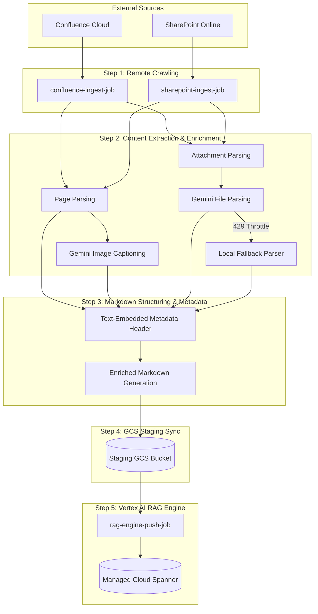
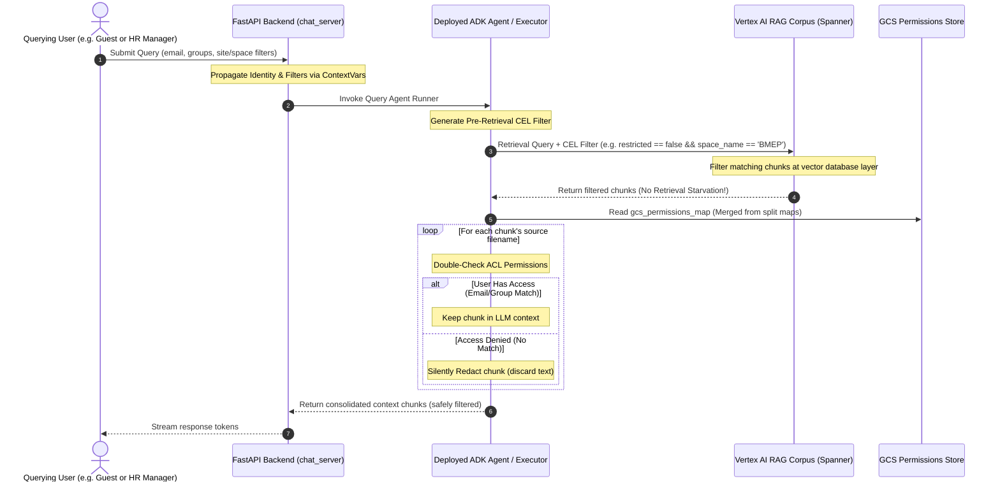

# Ingestion Pipeline Flow & Chunking Strategy

This document outlines the detailed architecture, end-to-end data flow, and exact chunking/filtering strategies implemented in the SharePoint and Confluence ingestion pipelines.

---

## 1. End-to-End Ingestion Data Flow

The ingestion pipeline is designed as a modular, resilient, and multi-threaded system that bridges external document repositories with the **Vertex AI RAG Engine**.



---

## 2. Step-by-Step Technical Execution

### Step 1: Remote Crawling & Filtering
*   **Confluence:** Crawls pages across specified spaces (configured via the comma-separated `CONFLUENCE_SPACES` environment variable).
*   **SharePoint:** Scans configured sites and libraries for documents.
*   **Cache Validation:** Compares modified timestamps of remote files with the locally stored (and GCS-synchronized) `ingestion_catalog.json`. Unmodified files are instantly skipped, enabling lightning-fast incremental synchronization.

### Step 2: Content Parsing & Multimodal Enrichment
*   **Image Captioning:** Inline page images are extracted, verified to be above `15 KB` (to ignore small icons/UI buttons), and captioned in parallel using `gemini-2.5-flash` to generate rich semantic text explanations.
*   **Attachment Handling:** Support for Word (.docx), Excel (.xlsx), PowerPoint (.pptx), and PDFs.
*   **Gemini Parser & Fallback:** Documents are parsed using the high-performance Gemini Document API. If the system hits API limits (HTTP 429), it automatically routes files through robust **local parsers** (PyPDF, docx, openpyxl, pptx) to ensure completion.
*   **Excel Memory-Safety:** Large spreadsheets are processed using a memory-safe, streaming chunk-splitter that breaks sheets into manageable markdown tables without overloading container RAM.

### Step 3: Markdown Structuring & Text-Embedded Metadata
*   The raw document text, captioned images, and parsed attachment contents are structured into unified Markdown (.md) documents.
*   Before saving, a structured **Text-Embedded Metadata Block** is injected at both the top and bottom of each generated Markdown file (see details in Section 4).

### Step 4: Staging Upload to Google Cloud Storage (GCS)
*   Enriched Markdown files and extracted images are uploaded to the staging GCS bucket (`RAG_GCS_BUCKET_NAME`).
*   The progress state is saved incrementally. After processing each individual page or attachment, `ingestion_catalog.json` and `gcs_confluence_map.json` are synced immediately to GCS, ensuring perfect resume capabilities in the event of timeouts.

### Step 5: Vertex AI RAG Engine Import
*   The `rag-engine-push-job` triggers `vertexai.rag.import_files` to ingest staging GCS Markdown files into the active RAG Corpus hosted on Managed Cloud Spanner (`RagManagedDB`).

---

## 3. Exact Chunking Strategy

When files are imported into the RAG Engine, the system utilizes the following exact chunking parameters:

*   **Chunk Size:** **512 tokens**
*   **Chunk Overlap:** **100 tokens**
*   **Max Embedding Requests Per Minute:** **900** (configured to safely prevent API rate limits).

### Native Layout-Aware / Structure-Aware Chunking
*   **Does RAG Engine natively use layout-aware chunking?**
    **Yes, absolutely.** Vertex AI RAG Engine natively utilizes layout-aware and structure-aware parsing models when ingesting files.
*   **How it works for our pipeline:**
    Because our ingestion jobs pre-process complex Confluence pages and SharePoint documents into clean **Markdown (.md)** files, the RAG Engine's chunker natively parses markdown elements (e.g., `#` headers, list bullet points, and tables) as **semantic chunk boundaries**.
    *   Instead of blindly splitting files in the middle of sentences or split tables, it aligns chunk partitions with double newlines (`\n\n`), section breaks, or table structures.
    *   This layout-aware behavior guarantees that tables and paragraphs are kept intact within the 512-token limit, ensuring maximum semantic grounding quality for the LLM.

---

## 4. Dual-Layered Metadata Enrichment

To deliver maximum search accuracy and operational flexibility, our pipeline implements a **Dual-Layered Metadata Strategy**:

### A. Text-Embedded Metadata (Vectorized Grounding)
During crawling, every generated Markdown file is enriched with a unified header and footer text block:
```text
source_url: https://lumen.atlassian.net/wiki/spaces/BMEP/pages/673300152381
title: Project Connect Deployment Plan
source_system: Confluence
space_name: BMEP
```
- **Natively Vectorized:** Since this header is part of the text body, the RAG Engine indexes it into the vector space.
- **Naturally Queryable:** Users mentioning "BMEP" naturally surface these files due to vector overlap.

### B.0 Database Schema Registration (Prerequisite)
By default, newly created Vertex AI RAG Corpora do not possess any metadata schema columns. To allow custom metadata tagging and CEL query-time filtering, you must register the necessary column schema keys.

A self-contained script `register_rag_schema.py` is provided to perform this registration on your active corpus in any target GCP project:
```bash
python3 register_rag_schema.py --project YOUR_PROJECT_ID --corpus-id YOUR_RAG_CORPUS_ID --location us-central1
```
This registers:
* `restricted` (BOOLEAN, FILE level)
* `space_name` (STRING, FILE level)
* `site_name` (STRING, FILE level)
* `source_system` (STRING, FILE level)

### B. Database-Level Schema Metadata (Post-Sync Enrichment)
Because bulk GCS import (`rag.import_files`) does not support user-specified metadata directly in its API signature, `push_rag_engine.py` performs a secure **Post-Sync Tagging Pass**:
1. It retrieves all corpus files via `rag.list_files()`.
2. It matches files to their respective GCS permission maps (`gcs_confluence_permissions_map.json` and `gcs_sharepoint_permissions_map.json`).
3. It calls `rag.batch_create_metadata()` to apply fields to each RAG file:
   - `restricted` (bool)
   - `source_system` (string)
   - `space_name` / `site_name` (string)

---

## 5. Enterprise Access Control List (ACL) & Dynamic Filtering

Our security pipeline implements **Dual-Layer Enforcement** to guarantee absolute data security with zero retrieval starvation:



### Phase A: Ingestion-Time (Crawl-Time) ACL Extraction
To prevent concurrency lockouts during parallel crawler runs, permissions are written to separate map files:
1. **Confluence Ingest (`ingest_gcs.py`)**: Writes permissions and `space_name` to `gcs_confluence_permissions_map.json`.
2. **SharePoint Ingest (`ingest_sharepoint_gcs.py`)**: Writes permissions and `site_name` to `gcs_sharepoint_permissions_map.json`.
3. **Dynamic Merge**: At startup, `agent_rag.py` downloads both files and merges them in-memory into a unified permissions lookup dictionary.

### Phase B: Query-Time Dual-Layer Enforcement

#### Layer 1: Pre-Retrieval Database-Level CEL Filtering
The agent (`agent_rag.py`) automatically translates user permissions and session filters into a pre-retrieval CEL expression:
- **Standard User**: `restricted == false`
- **Privileged User (e.g., HR Group)**: `restricted == false || department == 'hr'`
- **Targeted Slicing**: If the user specifies a site/space (via front-end selectors setting `current_query_space`/`current_query_site` ContextVars, or inline syntax like `space:SEC-COMP`), the expression is refined:
  `((restricted == false) || department == 'hr') && space_name == 'SEC-COMP'`

This limits the search space *before* similarity matching, preventing the "Top-K Deficit / Retrieval Starvation" problem where all returned chunks are redacted, leaving the LLM with no visible context.

#### Layer 2: Post-Retrieval Chunk Redaction (Safety Net)
The retrieved chunks are evaluated a second time in-memory. If a file's mapped `allowed_users` or `allowed_groups` do not match the user's thread-safe context identity, the chunk is instantly discarded, providing a redundant fail-safe.

This guarantees complete enterprise data safety: **unauthorized users can never access restricted information, and authorized users are never starved of legitimate context.**

---

## 6. Comprehensive Failure Reporting & Operational Auditing

To provide full operational visibility for the enterprise platform and operations teams, the pipelines automatically output detailed, structured JSON failure reports directly to your Cloud Storage bucket (`gs://multi-agent-sdlc-bucket/`). 

### Ingestion & Crawling Failure Reports
Each connector tracks crawling, API timeouts, permissions exceptions, and file-parsing issues (including attachment parsing failures):
*   **Confluence Crawler Failures:** Written to `gcs_confluence_failure_results.json` on GCS.
*   **SharePoint Crawler Failures:** Written to `gcs_sharepoint_failure_results.json` on GCS.

### RAG Engine Push Failure Reports
*   **RAG Ingestion Failures:** Written to `gcs_push_rag_failure_results.json` on GCS. This file tracks errors during the GCS-to-RAG import or metadata tagging phases.

#### Unified Schema for All Failure Logs:
```json
[
  {
    "file_name": "Project_Deployment_2026_Plan.md",
    "error_code": "InvalidArgument",
    "failure_reason": "Only one key-value pair is supported in UserSpecifiedMetadata.",
    "rag_progress_fail_code": "RAG_METADATA_TAGGING"
  }
]
```
Where `rag_progress_fail_code` categorizes the operational phase of the failure:
*   `RAG_BATCH_IMPORT`: File failed during GCS-to-RAG import.
*   `RAG_METADATA_TAGGING`: File failed during post-sync metadata tagging.