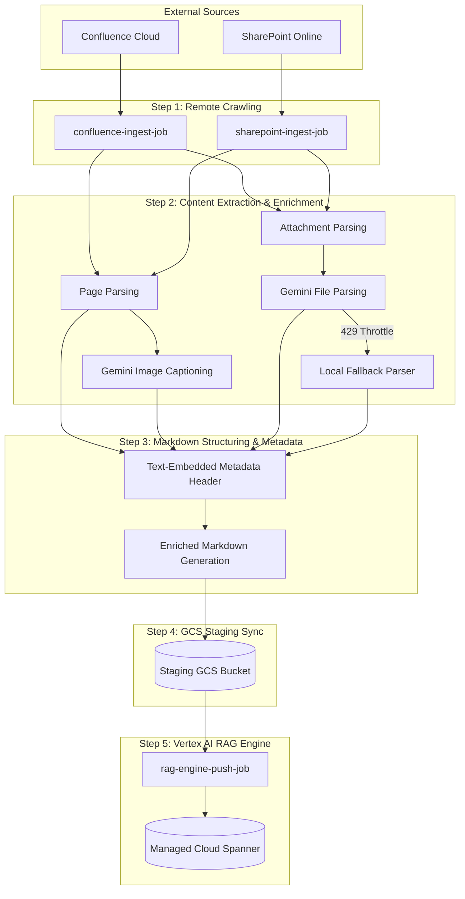
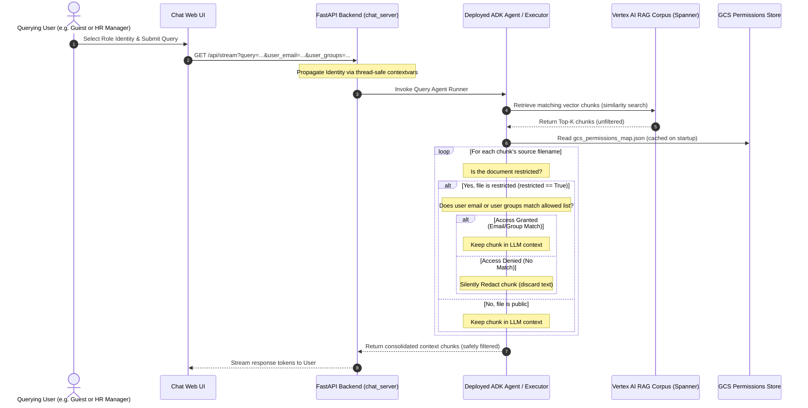

# Ingestion Pipeline Flow & Chunking Strategy

This document outlines the detailed architecture, end-to-end data flow, and exact chunking/filtering strategies implemented in the SharePoint and Confluence ingestion pipelines.

---

## 1. End-to-End Ingestion Data Flow

The ingestion pipeline is designed as a modular, resilient, and multi-threaded system that bridges external document repositories with the **Vertex AI RAG Engine**.



---

## 2. Step-by-Step Technical Execution

### Step 1: Remote Crawling & Filtering
*   **Confluence:** Crawls pages across specified spaces (configured via the comma-separated `CONFLUENCE_SPACES` environment variable).
*   **SharePoint:** Scans configured sites and libraries for documents.
*   **Cache Validation:** Compares modified timestamps of remote files with the locally stored (and GCS-synchronized) `ingestion_catalog.json`. Unmodified files are instantly skipped, enabling lightning-fast incremental synchronization.

### Step 2: Content Parsing & Multimodal Enrichment
*   **Image Captioning:** Inline page images are extracted, verified to be above `15 KB` (to ignore small icons/UI buttons), and captioned in parallel using `gemini-2.5-flash` to generate rich semantic text explanations.
*   **Attachment Handling:** Support for Word (.docx), Excel (.xlsx), PowerPoint (.pptx), and PDFs.
*   **Gemini Parser & Fallback:** Documents are parsed using the high-performance Gemini Document API. If the system hits API limits (HTTP 429), it automatically routes files through robust **local parsers** (PyPDF, docx, openpyxl, pptx) to ensure completion.
*   **Excel Memory-Safety:** Large spreadsheets are processed using a memory-safe, streaming chunk-splitter that breaks sheets into manageable markdown tables without overloading container RAM.

### Step 3: Markdown Structuring & Text-Embedded Metadata
*   The raw document text, captioned images, and parsed attachment contents are structured into unified Markdown (.md) documents.
*   Before saving, a structured **Text-Embedded Metadata Block** is injected at both the top and bottom of each generated Markdown file (see details in Section 4).

### Step 4: Staging Upload to Google Cloud Storage (GCS)
*   Enriched Markdown files and extracted images are uploaded to the staging GCS bucket (`RAG_GCS_BUCKET_NAME`).
*   The progress state is saved incrementally. After processing each individual page or attachment, `ingestion_catalog.json` and `gcs_confluence_map.json` are synced immediately to GCS, ensuring perfect resume capabilities in the event of timeouts.

### Step 5: Vertex AI RAG Engine Import
*   The `rag-engine-push-job` triggers `vertexai.rag.import_files` to ingest staging GCS Markdown files into the active RAG Corpus hosted on Managed Cloud Spanner (`RagManagedDB`).

---

## 3. Exact Chunking Strategy

When files are imported into the RAG Engine, the system utilizes the following exact chunking parameters:

*   **Chunk Size:** **512 tokens**
*   **Chunk Overlap:** **100 tokens**
*   **Max Embedding Requests Per Minute:** **900** (configured to safely prevent API rate limits).

### Native Layout-Aware / Structure-Aware Chunking
*   **Does RAG Engine natively use layout-aware chunking?**
    **Yes, absolutely.** Vertex AI RAG Engine natively utilizes layout-aware and structure-aware parsing models when ingesting files.
*   **How it works for our pipeline:**
    Because our ingestion jobs pre-process complex Confluence pages and SharePoint documents into clean **Markdown (.md)** files, the RAG Engine's chunker natively parses markdown elements (e.g., `#` headers, list bullet points, and tables) as **semantic chunk boundaries**.
    *   Instead of blindly splitting files in the middle of sentences or split tables, it aligns chunk partitions with double newlines (`\n\n`), section breaks, or table structures.
    *   This layout-aware behavior guarantees that tables and paragraphs are kept intact within the 512-token limit, ensuring maximum semantic grounding quality for the LLM.

---

## 4. Text-Embedded Metadata Filtering

Because the standard `vertexai.rag` SDK's GCS bulk-import API does not natively bind secondary sidecar files (like `metadata.jsonl`) without complex post-processing steps, we utilize a robust **Text-Embedded Metadata** strategy.

### The Header Structure
Every ingested document is enriched with a unified header and footer block during Step 3:
```text
source_url: https://lumen.atlassian.net/wiki/spaces/BMEP/pages/673300152381
title: Project Connect Deployment Plan
source_system: Confluence
```

### Why This is an Effective Filtering Strategy
1.  **Natively Vectorized:** Since this header text is physically part of the document body, the RAG Engine embeds it into the same vector space.
2.  **Naturally Queryable:** If an agent or user queries: *"Show me the Project Connect Deployment Plan in BMEP"* or *"Find SharePoint documents on BMVS-848"*, the vector engine matches keywords like `BMEP` (found in the `source_url` path) and `SharePoint` (found in `source_system`), automatically prioritizing the exact target chunk.
3.  **No Extra Database Cost:** It requires zero database schema migrations, extra `RagDataSchema` configurations, or programmatic API updates, delivering out-of-the-box relevance.

---

## 5. Enterprise Access Control List (ACL) & Query-Time Redaction

To secure restricted enterprise files, our RAG pipeline implements a highly granular, two-phase Access Control List (ACL) security system. This guarantees that user query permissions are dynamic, completely aligned with the source repository boundaries, and backwards compatible.



### Phase A: Ingestion-Time (Crawl-Time) ACL Extraction
During crawling, the ingestion jobs extract access controls from source permissions APIs and store them as metadata:
1.  **Confluence Ingest (`ingest_gcs.py`)**: For each page, queries Atlassian page restrictions APIs (`fetch_page_restrictions`). It compiles all specific read restrictions, including individual user accounts and group memberships.
2.  **SharePoint Ingest (`ingest_sharepoint_gcs.py`)**: For each item and library file, queries MS Graph API `/drives/{drive_id}/items/{item_id}/permissions`.
3.  **Permissions Schema**:
    If read restrictions are found, the crawler marks the file as `"restricted": true`, registers the allowed emails under `allowed_users`, and registers allowed AD groups under `allowed_groups`.
4.  **Metadata Staging**:
    *   Writes these permission properties directly into the generated markdown (.md) frontmatter header block.
    *   Dynamically registers them inside a centralized map file: `gcs_permissions_map.json`, which is synchronized incrementally back to the GCS bucket (`RAG_GCS_BUCKET_NAME`) at the end of every crawl run.

### Phase B: Query-Time Post-Retrieval Chunk Redaction
Because standard Vertex AI RAG engines store all text chunks collectively in a single-corpus database (`RagManagedDB`) on Spanner and cannot dynamically enforce multi-tenant ADK user query permissions out-of-the-box, we implement **Post-Retrieval Chunk Redaction** at query time:
1.  **Session Identity Resolution**: When a user queries the assistant, their email and group memberships are extracted (e.g. from FastAPI endpoints or A2A RequestContext metadata) and mapped into global, async-safe Python **`contextvars`** (`current_user_email` and `current_user_groups`).
2.  **Normalized ACL Verification**:
    The assistant retrieves the top-5 matching document chunks. For each chunk, it reads the source GCS filename and searches `gcs_permissions_map.json` using case-insensitive and space-insensitive matching.
3.  **Strict Redaction**:
    *   If the source document is marked as `"restricted": true`:
        *   If the user's email matches `allowed_users` **OR** the user's groups overlap with `allowed_groups` (case-insensitive), **access is granted** (the chunk is fully retained and visible to the user).
        *   Otherwise, **access is denied** and the chunk is silently discarded (redacted) before the response blocks are formatted or sent to the Gemini LLM.
    *   If the file has no restrictions or is not listed in `gcs_permissions_map.json`, it defaults to **public (access granted)**.

> [!IMPORTANT]
> **No Accidental Access Blocking**: "Restricted" in this context does *not* mean the document is blocked in general. It simply means that it is restricted *to a specific list of authorized users and groups on the original system (SharePoint or Confluence)*.
> - If a user has read access on the original system, their email/group matches the allowed lists, and **they will be able to query and view it normally** in the RAG assistant.
> - The redaction layer only filters chunks for users who **do not** have access to the file on the source systems.
> - This guarantees that the RAG assistant perfectly mirrors original enterprise boundaries without blocking any legitimate access.

This dual-layered architecture delivers complete enterprise safety: **users can never read restricted content they do not own, but are never blocked from viewing public or restricted documents they have legitimate access to.**